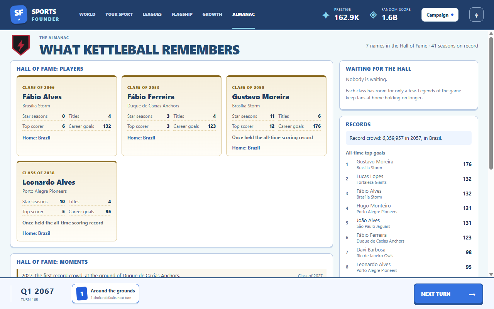
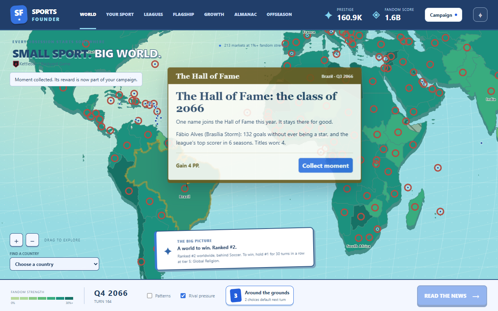
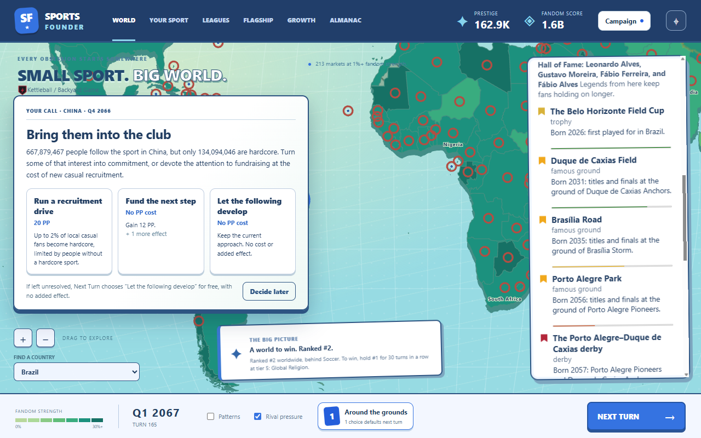

# What the sport remembers: the Hall of Fame, the Almanac and chants

Built October 7, 2026 (GDD v1.31, tech plan 2.18). Run `npm.cmd run dev`, play a few decades,
then open **Almanac** in the top bar.

## The Hall of Fame

A lightweight Hall with two wings. Every induction is read from retained records only.

- **Players** are inducted on points from their careers: 3 per star season, 2 per title won at
  their club, 2 per season as the league's top scorer, 5 for ever holding the all-time scoring
  record. They become eligible 2 seasons after retiring. Players at or above the bar of 20 go in
  best first, at most 2 a class; the rest wait and are never dropped. Backing and honors add
  nothing: fame comes only from facts. A player who was never a star can still get in on titles
  and top-scorer seasons.
- **Moments** inducts the sport's firsts, each once and one a class, oldest first: the founding
  club's first title, the first star, the first Professional and Elite leagues, the first record
  crowd, first taking #1, and the win.
- **Classes** are chosen at every flagship season's end. A class arrives as one card after the
  champion card. The card takes no moment slot and pays PP per inductee by wing and league tier.
  The sport's first class, or a class that inducts a scoring record holder, is a front page.
- **The effect:** each player inductee adds a permanent shrine weight (0.1) to their home
  country's tradition weight. It never decays and cannot be betrayed, and it counts inside the
  weight cap of 2. Being weight, it also raises the cost of moving the seat away. Induction renews
  the inductee's star legacy if it still lives.
- **No retroactive inductions:** a save from before format 23 starts with an empty Hall. Only
  players who retire after loading count, and only firsts recorded after it.

The **Almanac** tab holds the plaques (class, club, star seasons, titles, top-scorer seasons,
career scores, the record, and a link to the home country on the map), the Moments wing, the
**Waiting** list (players who clear the bar, by facts and never by points) and **Records** (the
record crowd, the all-time top ten scorers, the roll of champions with each season's top scorer).
It is the home for later history too: all-time leaderboards, the heatmap timelapse, history
charts. The country card names the Hall of Fame players from that country, and the map's pennant
counts them.

## Chants and anthems

`chant` is a seventh tradition type, held by one club. Derby and club rite are unchanged.

- **Birth:** an underdog title, or a club's first title won in a close finish once the league has
  played 10 seasons. A young league's titles are all firsts, so without that rule every campaign
  had a chant in its first seasons. The first chant is **the anthem**: it starts 0.25 stronger,
  and its birth is a headline. Names are invented terrace songs (`names.yaml`).
- **Spread with its fans:** chants are the only tradition that reaches abroad without Culture
  nodes. Once a year, a chant at strength 0.6 or more may gain a linked country (proximity or
  language) where the player's hardcore share is above the reach floor. The chance is 25%, plus
  any reach nodes, up to 4 countries. The first follower abroad is a toast. A follower is dropped
  when the player's hardcore fans there fall below the floor.
- **Renewal and betrayal:** the club's titles renew its chant, and it fades without them.
  Amendments offend it like any tradition. Opening venue level 4 or 5 (modernizing) betrays the
  chants of that country's clubs, as it does famous grounds.

The homegrown gear brand is **not** a tradition (topic 3): it stays the deals' demand-free
main-sponsor option.

[Narrow layout](narrow.png)

## Implementation and verification

`src/sim/hall-of-fame.ts` holds points, classes (`chooseClass`, run by culture's turn at each
season's end), shrine weight (joined into `traditionWeights`), class PP and headline rules, the
invariants and the Almanac snapshot (`hallSnapshot`). `src/sim/hall-cards.ts` offers the class card.
Chants live in `src/sim/culture.ts` (`CultureUpdate.chant`, `reachOut`, `quieten`,
`modernizeGrounds`), with their cards in `src/sim/tradition-cards.ts`. Every number is in
`hallOfFame` and `culture.chant` in `content/config.yaml`. Save format 23.

`tests/hall-of-fame.test.ts` covers the migration, points from records, the wait, the cap and the
backlog, no retroactive inductions, firsts, shrine weight inside the cap, the cards and the
snapshot. `tests/chants.test.ts` covers births, the anthem, renewal, reach without nodes and its
cap, going quiet abroad, modernization, and the cards. `npm run smoke` plays on until a class is
inducted, then shoots the class card, the Almanac wide and narrow, and a plaque's country
(`runs/smoke/55-hall-card.png` to `58-hall-country.png`). The runner prints a **Remembers** line:
inductees, the first player class, the anchor's shrine weight, chants and their spread, and how
often bots buy Culture nodes.
