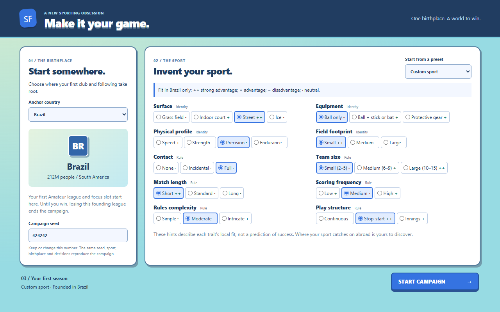

# Campaign setup

Implemented September 24, 2026. Launch with `npm.cmd run dev`.

The game opens on setup before creating any campaign state. Choose any of the 213 markets,
choose one of the four content presets, or edit all ten genome traits. Editing a preset
changes its label to Custom sport. The anchor's population and continent are shown alongside
the founding-league stakes.

The existing simulation supplies qualitative `++`, `+`, `-`, and neutral fit hints for the
selected country. These summarize each option's local lever effects; they are not win odds
or a world affinity preview. Changing the country refreshes the hints without changing the
genome. Late responses for a previous country are discarded.

A random seed is supplied and can be edited. Start campaign sends the exact anchor, complete
genome and seed to the worker's existing validated creation function. The first snapshot is
turn 1, quarter 0, with the founding league, focus and selected card in that country. Buttons
cannot issue duplicate starts or gameplay actions during launch. Loading and start failures
are retryable; a failed start preserves the draft.

This slice implements anchor selection, genome design, fit hints and seed selection.
The GDD's country difficulty ratings, recommended starts, sport/club naming and Easy/Normal/Hard
presets remain future work. Gameplay rules and the save format are unchanged.

## Verification

Worker/store tests cover no automatic campaign creation, all markets and presets, anchor
hints, custom genomes, seed 0, invalid requests, retry and duplicate-start guards.
The Electron smoke selects Tuvalu, switches anchors rapidly, chooses and edits Street Court,
rejects an invalid seed, and launches Brazil with seed 424242. It verifies every selected
trait in the resulting snapshot, then runs the existing map, purchase and focus checks.
Screenshots cover 1280 by 800 and a narrow viewport; output is in `runs/setup/final/`.

Validation: `npm run check` passed all **686 tests across 20 files**. The final Electron
smoke passed with zero renderer errors or remote requests, including the existing gameplay
checks after starting the custom campaign.
