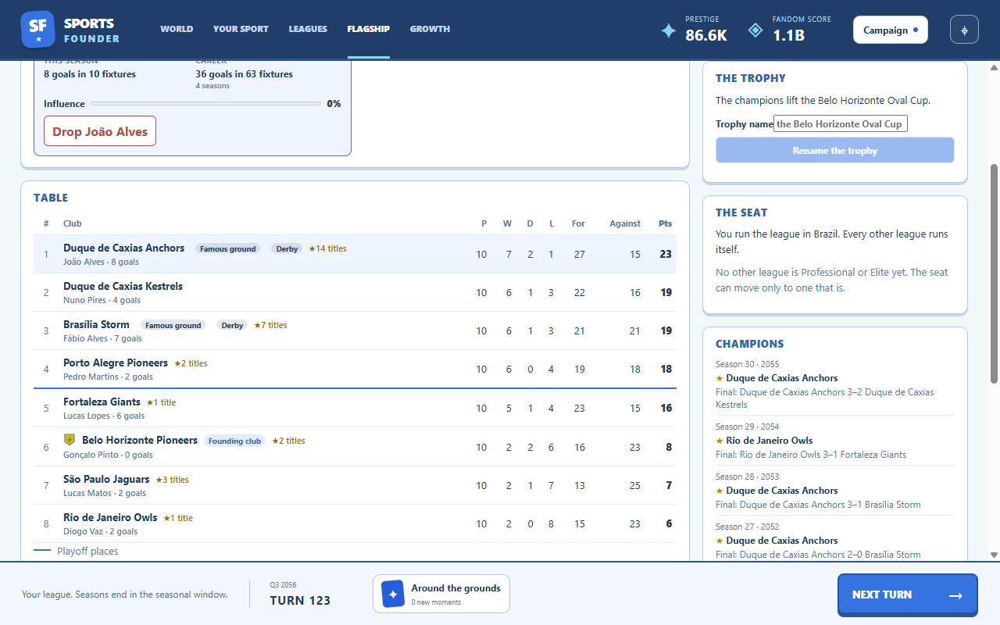

# Culture and traditions

Built October 4, 2026 (GDD v1.22, tech plan 2.11). First build: six tradition types born from
recorded facts, the shelter they give fans, the betrayals they resist, founding character's
biases, rivals' flavor traditions, and the Culture category of the growth tree. Chants and
anthems came on October 7 (GDD v1.31): see [What the sport remembers](../almanac/README.md). The
homegrown gear brand stays a deal partner, not a tradition; naming-rights dilemmas came with deals.

Culture is never bought. A tradition is born only from something the simulation recorded, held
by the player's fans in its countries, renewed when new facts repeat it, and lost when it fades,
its league folds or a betrayal breaks it. Every birth and every loss is a landmark and a moment.

## The six types

| Type | Born from | Renewed by | Name |
|---|---|---|---|
| Trophy | The flagship league's first season end | Every season played for it | Named by the player on the first champion card (default: the founding ground's cup) |
| Club rite | The founding club's first title (once only) | The founding club's titles | A pool keyed by birthplace ("the Lantern Walk" at docks) |
| Derby | The same two clubs first and second (or in the final) in 3 of 5 seasons; "Stoke it" on the repeat-final card counts as one meeting | Another such meeting | The two clubs' towns |
| Star legacy | A star retiring after 4+ star seasons, or as the league's all-time top scorer; retiring with honors starts it stronger | A new star breaking out at the same club | The star's name ("the João Alves style") |
| National name | A country's league first promoted to Professional | Each year the league stays Professional or better | A pool keyed by the country's language sphere |
| Famous ground | Three fame facts at a ground: titles won there, finals hosted (American format); the founding ground starts with one | A title or final there | The ground (every club has one: its town and a ground word) |

Thresholds are divided by the birthplace's ease for the type (factory and docks favor derbies,
village green the rite and the trophy, schoolyard and beach star legacies, barracks the rite and
grounds). Facts count from the season the save gained culture: older saves start with none.

**Strength** runs 0–1: born at 0.5 × the birthplace's ease, +0.25 per renewing fact, −0.05 for
each year without one. Lost at zero. Flagship traditions stop renewing while the seat is away
(their clubs are dormant) and renew again if it returns. In play most last 10–30 years.

## What they do

A country's **tradition weight** is the strength its fans hold (traditions from abroad at half
strength), × the Culture category's hold, capped at 2. Scaled by weight ÷ 2:

- generational turnover of the player's hardcore fans is cut by up to a third;
- rival poaching and reclaim of them are cut by up to 40% (world championships are unchanged);
- a famous ground adds 5% × its strength to casual conversion in its country (pilgrimage), and
  raises the champion moment's PP by up to 50%.

Traditions help only the player's sport. Rivals carry flavor traditions from content (the Old
Ground, the Ember Urn, the Samba Style...), shown in country cards with no effect.

## Betrayal

Each tradition remembers the rule traits it was born under.

- **Amendments:** a change that moves a trait away from a tradition's rule offends it (a move back
  toward it never does). Backlash in each country is multiplied by 1 + the ethos's rules factor
  × the offended strength held there, under the existing 25% cap, and each offended tradition
  loses 0.25 × the jump; at zero it is broken. The amendment review lists the traditions it
  offends. In the smoke campaign, amending contact from full to none broke one of the league's derbies and
  halved the trophy.
- **Moving the seat:** the purist cost in the country left is multiplied by 1 + 0.5 × the ethos's
  seat factor × its tradition weight. The seat review lists the traditions left behind.
- **Renaming the trophy** (seasonal window): ends the old trophy (a landmark), turns 3% × its
  strength × the ethos's rename factor of its followers' hardcore fans casual, and starts a
  fresh trophy. The review shows the count.

Ethos sets the three multipliers: a gentleman's game resents rule changes (×1.3) more than seat
moves; working-class and rebel games resent seat moves (×1.3) more than rule changes; a family
game resents a renamed trophy (×1.3). Content validation keeps every birthplace's eases and every
ethos's multipliers at a geometric mean within 1 ± 0.1: character changes a campaign's shape, not
its difficulty.

## Where to see them

- **Map:** a pennant on every country whose fans hold a tradition; the country card lists each
  (name, type, origin fact, strength bar) and rivals' traditions there.
- **Your sport:** the Rulebook's Traditions section by type, with the rules each was born under;
  lost ones greyed with their end.
- **Flagship:** Derby, Rite and Famous ground tags on club rows; the trophy card (free naming
  while the first champion card is open, renaming in the window with a review).
- **Cards:** a moment for every tradition born (PP by type: trophy 4, derby, legacy, national
  name and ground 6, rite 8) and lost.

Strength is always a bar described in words (strong, steady, fading), never a number.

Narrow layouts: [Rulebook](traditions-narrow.png) · [Flagship](flagship-narrow.png) ·
[Map](map-narrow.png)

## The Culture category

Unlocks at PP tier 4. Nurtures traditions that exist; never creates one. Four effects, each
optionally limited to a tradition type: **strength** (bigger renewals, slower fading), **reach**
(a yearly chance for a tradition at full strength to gain a follower linked by borders and sea or
by language, where the player has fans; national names never spread), **protection** (less
strength lost to offending amendments) and **hold** (more weight per unit of strength, which
makes fans stickier and betrayals costlier alike). Ten nodes: Oral History, Derby Days,
Supporters' Trusts, Club Museum, Hall of Legends, Travelling Support, Twinned Towns, Heritage
Listing, and the fork Heritage Trust (protection and hold) or Living Game (reach and strength,
less protection).

## Balance

Measured October 4, 2026 (builder, 12 typical anchors, 200 turns):

- **Pacing passes** on seeds 1–3 (tier 5 median turn 121, first win 161) and seeds 4–6 (run as
  4–5 and 6 to stay inside the five-minute budget; tier 5 at 123 and 125, first win 163 and 160).
- **The #1 contest stays about half:** lost before the win in 21 of 36 campaigns on seeds 1–3
  (58%) and 15 of 34 on seeds 4–6 (44%): 36 of 70 (51%), against 53% before Culture.
- **Differentiation as invented: 5 of 6 pairs**, unchanged. With amendments (reported only) the
  sports now stay far more distinct (mean shared top-10 markets 1.3–5.7 per pair, against 1 of 6
  pairs passing at v1.20): fans defending traditions slow the drift toward the giants' tastes.
- **Builder amendments fell** from a median of 3–4 to 1–2 per campaign: traditions make rule
  changes costlier, as intended.
- The builder never bought a Culture node in these runs (its value-per-PP rule prefers the
  grassroots spine, as it already skipped Media). The options experiment (node dominance) needs
  340 campaigns, about 20 minutes, and was not run.
- A 200-turn campaign takes about 14% longer (5.0 s against 4.4 s for one Mauritius campaign).

## Implementation and verification

`src/sim/culture.ts` holds the state, births, renewal, decay and loss (`updateCulture`, run once
per turn after the league evaluation, reading landmarks and season summaries in order), the
weights and shelter, the betrayal helpers, the trophy actions and the snapshot. Reach rolls on
culture's own random stream. Amendment backlash is in `src/sim/rules.ts`, the seat cost in
`src/sim/flagship.ts`, the effects in `src/sim/quarter.ts`, the cards in
`src/sim/tradition-cards.ts`. Every number is config (`culture`; `identity.trophyNameMaxLength`);
founding character's multipliers are in `content/identity.yaml`, names in `content/names.yaml`,
nodes in `content/growth-tree.yaml`. Save format 18: format 17 saves gain culture with no
traditions and facts counted from the season under way.

Tests: `tests/culture*.test.ts` (content validation, saves, every birth rule, decay, folds,
effects, betrayal, trophy naming, cards, stokes, reach, the snapshot). The smoke run
(`src/main/culture-smoke.ts`) screenshots the Rulebook's traditions, the trophy card and the
seat country's card in both layouts (`runs/smoke/43-…48-*.png`).
