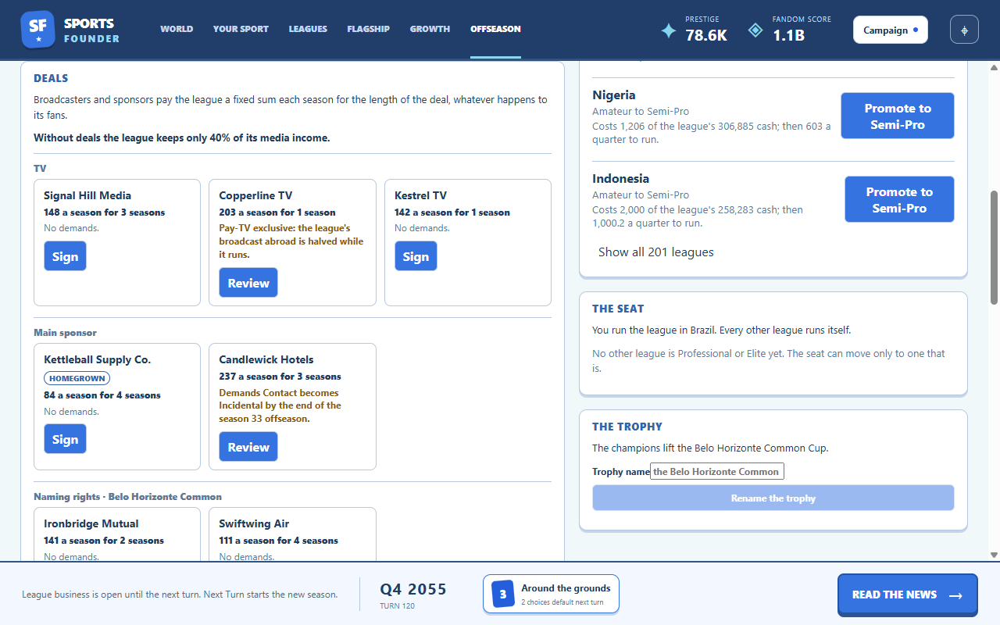
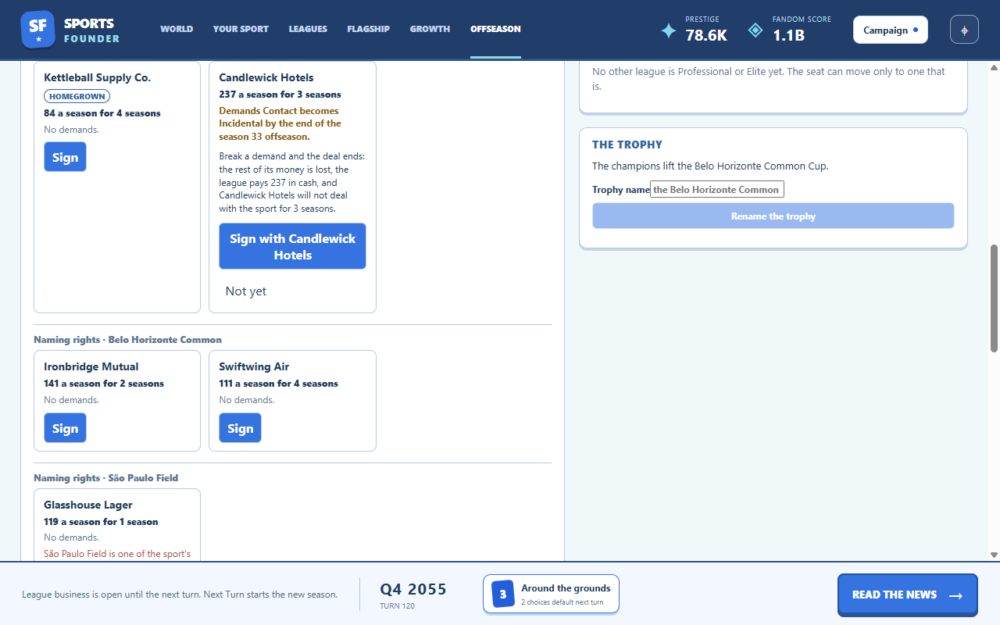

# Flagship deals

Built October 5–6, 2026 (GDD v1.28, tech plan 2.15). Run `npm.cmd run dev`, play to the first
offseason, then open **Offseason** in the top bar.

The flagship league signs TV and sponsor deals; every other league keeps its single combined media
line. Without deals the flagship keeps only 40% of that line (once its first offers have arrived).
A deal pays a fixed sum each season for its term, 1–5 seasons, whatever happens to the fans.

- **Slots:** one TV slot; sponsor slots by league tier (Amateur 1, Semi-Pro 1, Professional 2,
  Elite 3), the first being the main sponsor, where the homegrown gear brand ("{sport} Supply Co.")
  always offers, demand-free and smaller; a naming-rights slot for the founding ground and each
  famous ground.
- **Offers:** 2–3 per open slot each offseason, from invented partners (`content/names.yaml`),
  rolled on the deals' own random stream. They lapse when the offseason closes. The partner whose
  deal just ended offers a renewal. The PP tier caps what an offer's base value can reach.
- **Demands** pay more and never block: doing the thing breaks the deal. A *tier floor* breaks
  when the league falls below it (a step-down or a fold), a *seat lock* when the seat leaves, a
  *rule change* when its deadline offseason closes without the amendment. *TV exclusivity* never
  breaks; it halves the broadcast's lift abroad while it runs. Rule demands are rare and never
  required: every slot always has an offer without one, at most one an offseason, only on a deal
  still running at its deadline, none while one is due.
- **A breach** ends the deal (its remaining value lost), the league pays a season's value in cash,
  the partner will not deal for 3 seasons, and the news is a big moment (The Business Pages).
- **Naming rights betray:** on a famous ground they wear its tradition down, cut its pilgrims while
  the name stands and turn some hardcore fans casual in the seat country; on the founding ground
  they offend the club rite.

- **Clauses** (GDD v1.29) are what partners want of the product, judged at every season's end
  the deal pays: *competitive balance* (TV: no runaway or foregone season), *a star* (sponsors: a
  star playing at the seat) and *fans* (any partner: the seat country's fans no fewer than at the
  last season's end). Met: a bonus of 10% of the annual value and a better renewal. Missed: two in
  a row and the partner walks (big news), the rest of the deal lost, with no penalty. Clauses
  come only on deals of three seasons or more, where a walk can cost something.

Signing asks first only for a demand or a betrayal. The Flagship tab shows the same panel
read-only. The seat-move review warns of seat locks, the step-down confirmation of tier floors,
and the Rulebook lists open rule demands with their due season.

[Narrow layout](narrow.png)

## Implementation and verification

`src/sim/deals.ts` makes offers (`offerDeals`, once an offseason at the end of `endTurn`), signs
(`signDeal` through `applyAction`), pays (`leagueIncomePerQuarter`, used by the quarter step, the
snapshot and the bots), breaks (`breakDeals`, after every action, when the offseason closes and
after the league evaluation) and snapshots (`dealsSnapshot`). Naming-rights betrayal is
`betrayGround` in `src/sim/culture.ts`; deal news is `src/sim/deal-cards.ts`. Save format 20.
Clauses are judged by `judgeClauses` (`src/sim/deal-clauses.ts`) once an offseason before its
offers are made; a walk is `dealWalked`. Save format 21. Every number is `flagship.deals` in
`content/config.yaml`.

`tests/deals.test.ts` (24 tests) covers offers, signing, lapsing, renewal, the rule-demand limits,
countermoves, the TV fork, the cap, revenue, the slate band, every demand kind and forced breach,
both betrayals, news, the snapshot, bots and saves. `npm run smoke` signs a deal on the offseason
screen through the review and checks both layouts and the read-only tab
(`runs/smoke/41-deals.png` to `44-deals-narrow.png`).

**Measured** (builder, 12 typical anchors, seeds 1–3, 200 turns): pacing passes pooled (tier 2 at
turn 33, tier 5 at 120.5, first win at 159); #1 lost before the win 21/36 (58%); a full slate of
ordinary offers before the PP-tier cap is 103–105% of the media line it replaces at Amateur and
Semi-Pro, 105–108% at Professional and 118–119% at Elite (target 100–120%); deal income is 14% of
the flagship's income; the builder's flagship never reached Near-Collapse. Under the naive
greedy-spread bot (12 anchors, seed 1) the flagship spent 13% of turns Struggling against 2%
before deals, 0.2% at Near-Collapse against none, and one anchor collapsed (Sweden) against none:
deals make careless play harder, not the flagship unsinkable. Bots break almost every rule demand
they sign (362 of 374): they take the premium and amend rules by their own fit.

**Clauses measured** (same campaigns, after GDD v1.29, rule demands at half the chance): pacing
passes pooled (tier 2 at turn 33, tier 5 at 120, first win at 158); #1 lost before the win 20/36
(56%); the slate stays in the band. Balance was met 89% of seasons judged (5% of its partners
walked), star 75% (33% walked), fans 60% (39% walked). Bots still broke 181 of the 186 rule
demands they signed.
