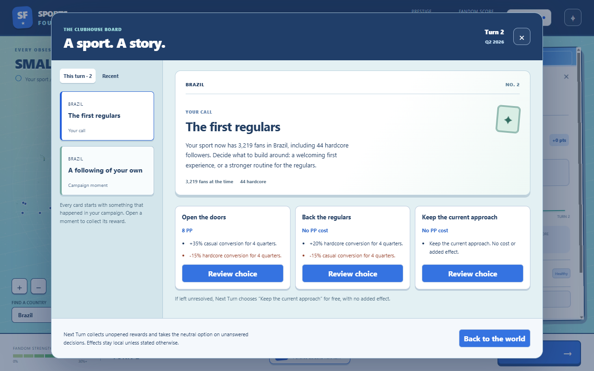

# Around the grounds

The Clubhouse story board is playable from **Around the grounds** in the bottom bar on World
or Growth. This is the first eight-card deck, not the complete planned 40–60-card library.

Cards use the current Matchday palette and Fresh Club typography: navy board header, aqua
background, raised white story cards, small collectible-style stamps and visible trade-offs.
The board works at 1280×800 and scrolls at narrow widths.

[Confirmation](confirmation.png) · [Collected moment](moment.png) · [Narrow layout](narrow.png)

## Playing it

- **Moments** report actual milestones. Opening one immediately collects its PP. Unopened
  rewards collect automatically before the next turn; there is no reward for clicking faster.
- **Decisions** show the current PP price and each effect before spending. Review, then confirm
  or keep thinking. Choices apply once, stay local and do not advance the turn.
- Each decision has an explicit free, no-effect default. Next Turn uses that option for unanswered
  decisions. The launcher, each card and the board footer explain this behavior; no paid choice
  is made automatically. Current headless bots use these neutral defaults too.
- **Recent** keeps the latest 60 receipts (content-configured). Once-only markers and cooldowns
  survive after a receipt leaves the visible journal. **Local effects in play** lists modifiers
  and their remaining quarters.

## Initial deck

| Card | Recorded trigger | What it offers |
|---|---|---|
| The first regulars | Founding market's actual audience after a quarter | Casual reach versus hardcore conversion, with opposite downsides |
| A following of your own | First local audience milestone | A PP pickup |
| Put it on the fixture list | A newly formed league that still exists | A PP pickup |
| A bigger stage | An actual league promotion | A PP pickup |
| An audience worth reaching | A sufficiently established local audience | Incoming media or neighbouring-market exposure |
| Bring them into the club | An audience with room for more hardcore followers | Recruitment or fundraising with slower casual recruitment |
| A league under strain | A Struggling or Near-Collapse league | Health relief at a hardcore-fan cost, or temporary outreach |
| They have noticed | A recorded rival escalation | A local rival setback or investment in the player's own base |

Text names the actual country and rival and freezes the observed fan counts when a card is
offered. It does not invent players, finals, injuries, sponsors or results that the simulation
doesn't model. Current costs and affordability still refresh when the player acts.

## Rules and boundaries

`content/events.yaml` defines every trigger, priority, threshold, cooldown, price, effect,
queue limit, duration and journal limit. Locale text stays in `en.json`. Zod rejects unknown
effects, duplicate template/choice IDs, invalid context and paid or effectful defaults.

The closed effect vocabulary supports PP grants, local casual/hardcore conversion multipliers,
incoming spread channel multipliers, fan-bucket transfers, hardcore demotion, named-rival
setbacks and one-rung league-health changes. Hardcore remains exclusive; transfers are rounded
down and limited to available people. Rival setbacks demote that rival's fans to casual about
the same rival; they do not give those fans to the player. Health relief neither creates cash
nor prevents the next turn's normal health evaluation.

Temporary effects last exactly their configured number of quarters. Stacking is multiplicative
within content-defined bounds. The quarter engine applies and expires them; the UI only reports
their values. The immutable `applyAction` path validates choices and collections, and the shared
store guard blocks duplicate actions while the worker responds.

Generation is deterministic: priority, then audience, then content order. There is no extra
random stream. Moment capacity scales with elapsed quarters and active markets up to a cap;
decisions are capped at two per turn in this deck. This is a curated selection of stories,
not an exhaustive list of all landmarks; skipped landmarks remain in simulation history.
New cards are offered after league, tier and win evaluation. Ended campaigns offer no new cards.

Save format **7** includes pending decisions/moments, resolutions, cooldown markers, the
landmark cursor and active modifiers. Version 6 migrates to an empty event journal and skips old
landmarks, so loading an old campaign doesn't replay its promotions as new rewards. The
presentation wrapper remains version 1 and preserves sparklines as before.

## Verification

`npm run check` passed: type checks, lint, simulation purity and **717 tests across 25 files**.
`npm run smoke` also passed, including the existing map, growth, league and save/load flows.

Event tests cover translated content, invalid definitions, actual trigger facts, queue caps,
once-only markers, costs, stale/double actions, local effects, exact expiry, spread channels,
fan conservation/capacity, rival setbacks, league health, PP receipts, migrations and identical
continuation after saving both pending decisions and active effects.

The Electron smoke plays a real campaign without injecting state. It cancels a decision,
confirms with a double click, writes and restores a pending choice through the actual file UI,
checks saved modifier durations, collects a moment, checks both viewport sizes and continues
through the existing map, growth, league and save/load checks. Reports live in the ignored
`runs/events-final/` directory. The final smoke passed with no renderer errors or remote
requests; the screenshots above come from that run.

## Next pass

Expand the deck toward 40–60 cards after playing these examples. Tune frequency, rewards and
trade-offs together with growth prices and late-game rival pressure; these mechanics change
campaign pacing. Add bot choice policies before using headless runs to judge the decision deck.
Broader tier-weighted negative-event variety and the remaining setup polish are still ahead.
