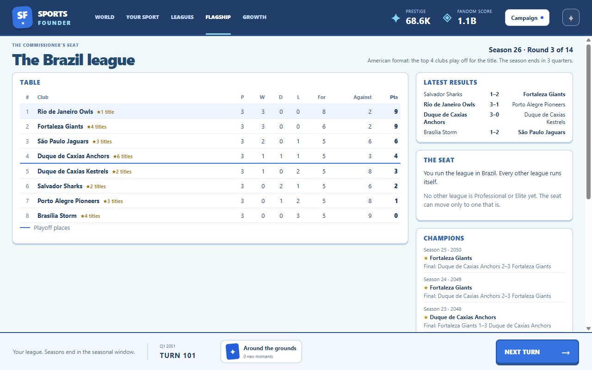
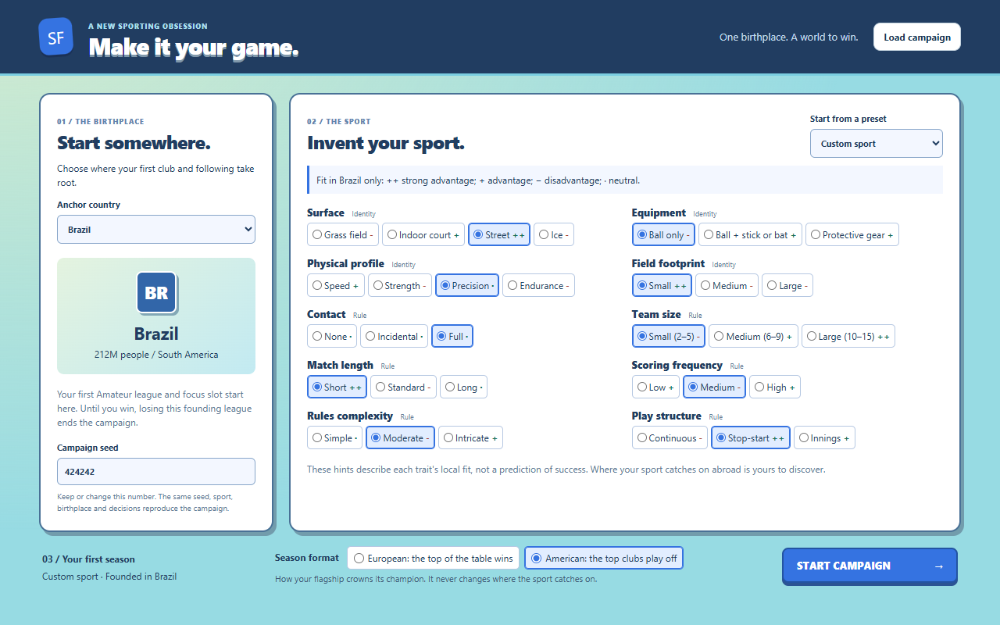
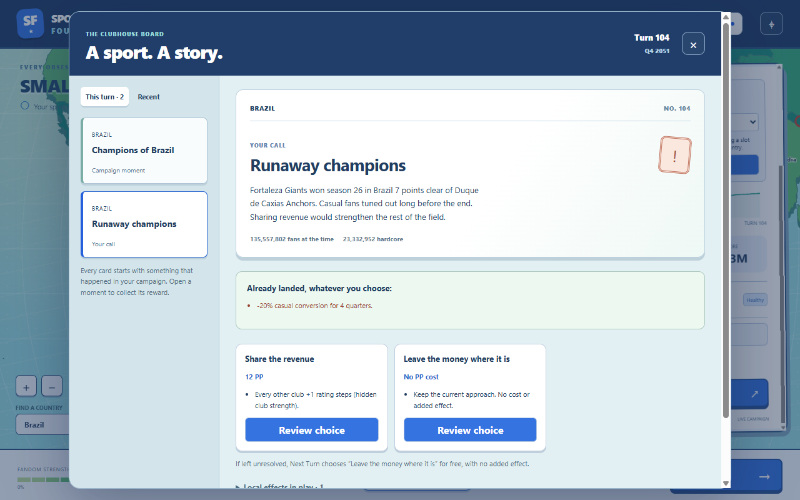

# The flagship league

Implemented October 2–3, 2026 (GDD v1.11, v1.13, v1.14). Run `npm.cmd run dev`, start a campaign,
then open **Flagship** in the top bar.

The player is commissioner of one league, the flagship. The anchor's founding league holds the seat
from turn 1. The screen shows:

- **Table:** this season's standings, ranked by points, then score margin, then score for. Each
  club's championships are shown beside its name. In the American format a line marks the playoff
  places.
- **Latest results:** the most recent round. Winners are in bold.
- **The seat:** where the player runs the league. In the seasonal window the seat can move to a
  Professional or Elite league elsewhere. Reviewing the move shows the purist cost: a share of the
  current seat country's hardcore fans turn casual (more when leaving the anchor). The move happens
  when the season ends and can be cancelled before then. A flagship abroad that folds sends the
  seat home for free.
- **Champions:** the last ten seasons with the year, the champion and the runner-up, or the final in
  the American format.

Clubs are based in real towns and cities of their market (`content/places.yaml`, from GeoNames);
only their nicknames are invented. Bigger places host more clubs. The league has 8 clubs at Amateur,
12 at Semi-Pro, 16 at Professional and 20 at Elite; promotion admits expansion clubs at the next
season.

## Season format at creation

**European:** the top of the table is champion. **American:** the same regular season, then
single-match knockout playoffs for the top 4 clubs (8 from 12 clubs up), higher seed at home. The
format never affects where the sport spreads.

[Narrow layout](narrow.png)

## Implementation and verification

`src/sim/flagship.ts` runs seasons, playoffs, rating drift, seat moves and the snapshot the screen
reads (`TurnSnapshot.flagship`). The flagship rolls its matches on its own random stream, so per-turn
world data is byte-identical with and without it. `src/renderer/src/flagship/FlagshipScreen.tsx`
renders it; the seat move goes through the worker's `applyAction` like every other action.

`tests/flagship.test.ts` covers schedules, both formats, determinism and save/resume, club growth,
seat rules and costs, the free return home and the format 7 → 8 migration. `npm run smoke` starts
an American-format campaign, opens the screen late in the campaign and checks the table, results,
champions, playoff line and both layouts (`runs/smoke/32-flagship.png`, `33-flagship-narrow.png`).
The seat-move controls with eligible targets are not reached in the smoke campaign; their rules are
covered by the simulation tests.

## The season as cards

Every season end reaches the player through the story board (GDD v1.15), built only from the
recorded season summary. The **champion moment** names the champion and runner-up and pays PP by
the flagship league's tier (4 / 6 / 10 / 15); it always appears and never takes a moment slot. At
most **one story card** follows, the first that qualifies in a fixed order: foregone league (a
fourth straight title or more), runaway, dynasty (a third straight title), repeat final, underdog,
first title, close finish. A story counts against the turn's decision cap but is offered first.

- **Pressure cards** (foregone league, runaway) drain casual conversion in the flagship country the
  moment they appear. Paying adds the fix (club strength changes); it never cancels the drain.
- **Club strength** (`clubRating`) moves the champion's rating, or every other active club's, by
  config steps. Only flagship season cards may use it (rejected at load otherwise). Ratings stay
  hidden; the ratings recorded at the season's start never move.
- **Cooldowns count in seasons.** First title and close finish wait 2 seasons; while one waits,
  the next qualifying story is told instead. The rarer stories have no cooldown.
- **American format:** runaway needs the playoff champion to have topped the table by the gap; a
  close finish is the final won by one score (two in a high-scoring sport) or settled by deciders. **European:** a close finish
  is the top two within one win.

Thresholds live in `config.yaml` (`flagship.stories`); the cards and their prices in
`content/events.yaml`; story detection in `src/sim/season-stories.ts`. Save format 9 records each
season's start ratings and counts season-card cooldowns by season; format 8 saves migrate with
today's ratings as the current season's start (ratings never moved mid-season before) and no
cards offered. `tests/season-cards.test.ts` covers every story, the priority order, both formats,
caps, cooldowns, the arrival drain, club strength, content validation, save round-trip and the
8 → 9 migration. `npm run smoke` plays to a season end and opens its story card
(`runs/smoke/34-season-card.png`).

## Scoring frequency

Built October 3, 2026 (GDD v1.16, tech plan 2.6 step 1). The genome's scoring frequency sets a
match's scoring chances per side: low 3, medium 6, high 14 (`flagship.match.chances`), each with
its own scoring rate (`baseRate`, `ratingEffect`). Medium is the rule every season used before.
Low and high were fitted on exact match odds so the stronger club wins about as often at every
rating gap (stronger club's win %, gaps 5 / 10 / 20: low 47 / 61 / 85, medium 50 / 62 / 83, high
53 / 63 / 82). Low-scoring sports draw more and the weaker club wins less; high-scoring ones draw
less and upset more.

A season plays one rule throughout: `FlagshipState.scoring` is fixed at the season's start and
each `SeasonSummary` records it. Save format 10 adds both; format 9 saves migrate with every
season so far, and the one in progress, on the medium rule, and the genome's rule starts with the
next season.

Story rates were measured once per frequency, flagship only (Brazil, 5 seeds × 200 seasons per
cell, Amateur and Professional leagues). European rates and runaway moved by a few points. The
American close finish (final won by one score) drifted: low 75%, medium 62%, high 41–43%, so the
high-scoring margin is 2 (`closeFinalMargin`), which gives 64–65%; low stays more often close, as
the GDD intends. `tests/flagship-match.test.ts` covers the fitted odds, draws by frequency, the
season-start rule, the world's untouched random sequence under every rule and the 9 → 10
migration.

## Leading players

Built October 3, 2026 (GDD v1.16, tech plan 2.6 step 2). Simulation only: nothing on screen yet,
and players do not score until step 3. Every club has one named leading player who stands in for
the squad: born in a real place of the club's market (drawn as club places are), with an invented
name and a hidden peak and current skill (`flagship.players` in `config.yaml`). Founding players'
ages are spread from 18 to 32 so the first generation does not retire at once; current skill is
peak skill times the career curve for their age.

Names come from pools in `names.yaml` (`playerNames`): 30 given and 30 family names for each of
the 54 language spheres, plus six regional pools for markets whose language sphere does not match
how people are named (Nigeria is in the English sphere, Senegal in the French one). Each name is
a random pairing; pairs that would name famous real athletes or public figures were avoided when
the pools were written. Chinese, Japanese, Korean, Vietnamese, Hungarian and Khmer names put the
family name first. Content validation requires a pool for every market, at least 20 distinct
names per list and no unused pool.

Any active club without a leading player gets one when the league's clubs are fitted: founding
clubs, expansion clubs and clubs from older saves. Players stay with their clubs when the seat
moves. Generation draws on the flagship's own stream, so the world is untouched. Save format 11
adds the players; format 10 saves migrate with a fresh leading player at every active club.
`tests/flagship-players.test.ts` covers founding players, name pools and order, expansion,
dormant clubs, the untouched world and the 10 → 11 migration.
