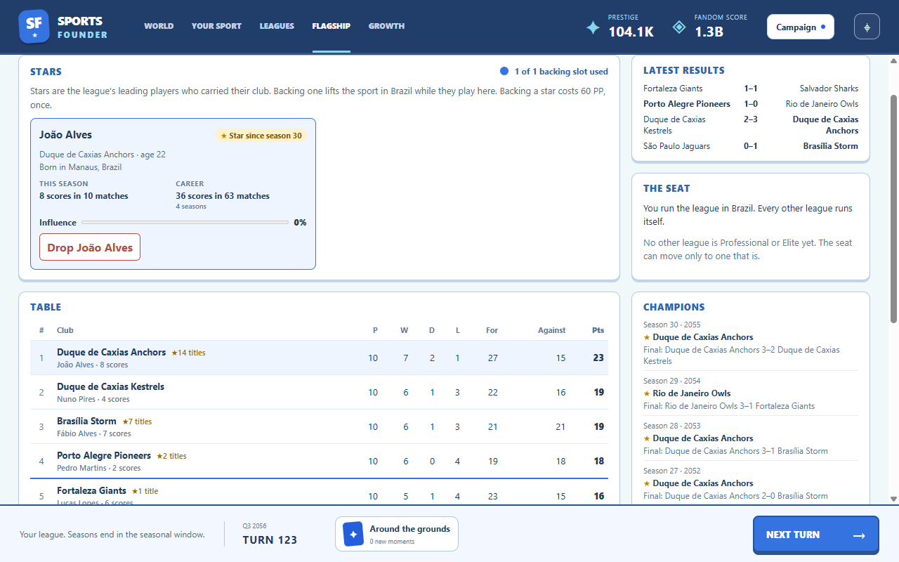
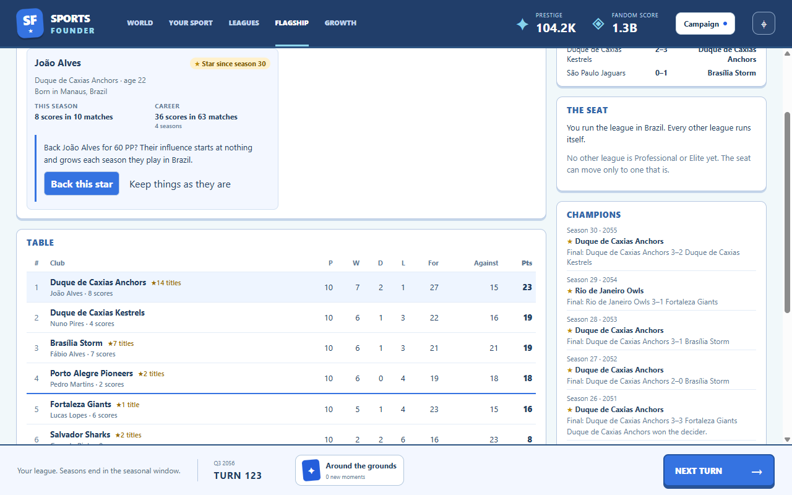
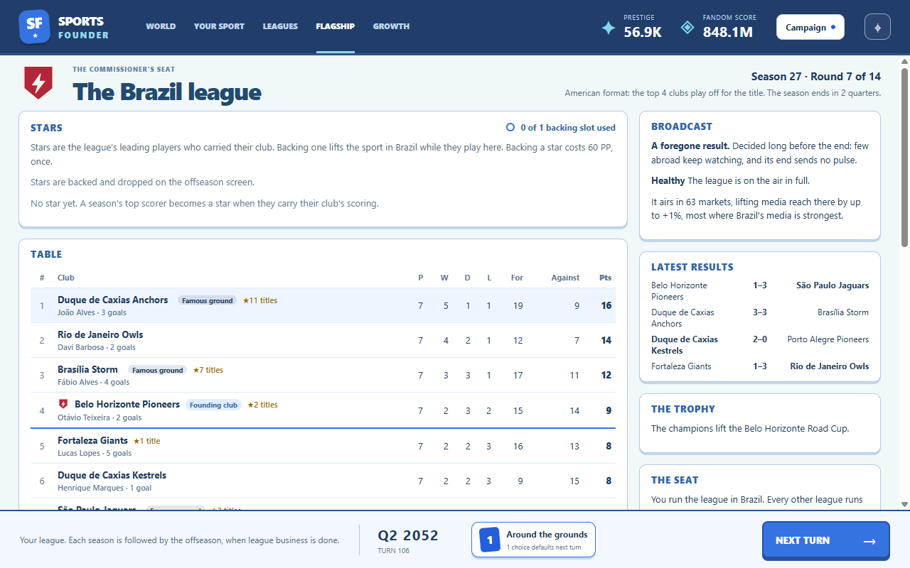
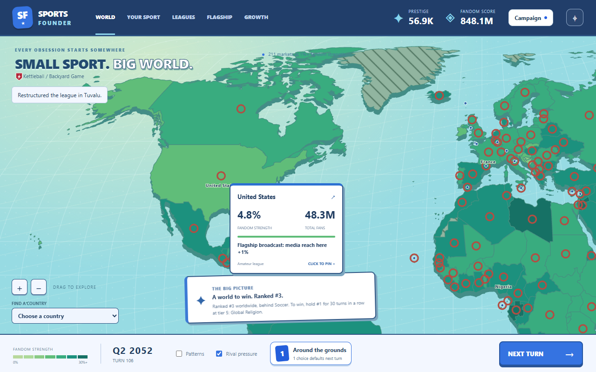

# The flagship league

Implemented October 2–3, 2026 (GDD v1.11, v1.13, v1.14). Run `npm.cmd run dev`, start a campaign,
then open **Flagship** in the top bar.

The player is commissioner of one league, the flagship. The anchor's founding league holds the seat
from turn 1. The screen shows:

- **Table:** this season's standings, ranked by points, then score margin, then score for. Each
  club's championships are shown beside its name. In the American format a line marks the playoff
  places.
- **Latest results:** the most recent round. Winners are in bold.
- **The seat:** where the player runs the league. In the seasonal window the seat can move to a
  Professional or Elite league elsewhere. Reviewing the move shows the purist cost: a share of the
  current seat country's hardcore fans turn casual (more when leaving the anchor). The move happens
  when the season ends and can be cancelled before then. A flagship abroad that folds sends the
  seat home for free.
- **Champions:** the last ten seasons with the year, the champion and the runner-up, or the final in
  the American format.

Clubs are based in real towns and cities of their market (`content/places.yaml`, from GeoNames);
only their nicknames are invented. Bigger places host more clubs. The league has 8 clubs at Amateur,
12 at Semi-Pro, 16 at Professional and 20 at Elite; promotion admits expansion clubs at the next
season.

## Season format at creation

**European:** the top of the table is champion. **American:** the same regular season, then
single-match knockout playoffs for the top 4 clubs (8 from 12 clubs up), higher seed at home. The
format never affects where the sport spreads.

[Narrow layout](narrow.png)

## Implementation and verification

`src/sim/flagship.ts` runs seasons, playoffs, rating drift, seat moves and the snapshot the screen
reads (`TurnSnapshot.flagship`). The flagship rolls its matches on its own random stream, so per-turn
world data is byte-identical with and without it. `src/renderer/src/flagship/FlagshipScreen.tsx`
renders it; the seat move goes through the worker's `applyAction` like every other action.

`tests/flagship.test.ts` covers schedules, both formats, determinism and save/resume, club growth,
seat rules and costs, the free return home and the format 7 → 8 migration. `npm run smoke` starts
an American-format campaign, opens the screen late in the campaign and checks the table, results,
champions, playoff line and both layouts (`runs/smoke/32-flagship.png`, `33-flagship-narrow.png`).
The seat-move controls with eligible targets are not reached in the smoke campaign; their rules are
covered by the simulation tests.

## The season as cards

Every season end reaches the player through the story board (GDD v1.15), built only from the
recorded season summary. The **champion moment** names the champion and runner-up and pays PP by
the flagship league's tier (4 / 6 / 10 / 15); it always appears and never takes a moment slot. At
most **one story card** follows, the first that qualifies in a fixed order: foregone league (a
fourth straight title or more), runaway, dynasty (a third straight title), repeat final, underdog,
first title, close finish. A story counts against the turn's decision cap but is offered first.

- **Pressure cards** (foregone league, runaway) drain casual conversion in the flagship country the
  moment they appear. Paying adds the fix (club strength changes); it never cancels the drain.
- **Club strength** (`clubRating`) moves the champion's rating, or every other active club's, by
  config steps. Only flagship season cards may use it (rejected at load otherwise). Ratings stay
  hidden; the ratings recorded at the season's start never move.
- **Cooldowns count in seasons.** First title and close finish wait 2 seasons; while one waits,
  the next qualifying story is told instead. The rarer stories have no cooldown.
- **American format:** runaway needs the playoff champion to have topped the table by the gap; a
  close finish is the final won by one score (two in a high-scoring sport) or settled by deciders. **European:** a close finish
  is the top two within one win.

Thresholds live in `config.yaml` (`flagship.stories`); the cards and their prices in
`content/events.yaml`; story detection in `src/sim/season-stories.ts`. Save format 9 records each
season's start ratings and counts season-card cooldowns by season; format 8 saves migrate with
today's ratings as the current season's start (ratings never moved mid-season before) and no
cards offered. `tests/season-cards.test.ts` covers every story, the priority order, both formats,
caps, cooldowns, the arrival drain, club strength, content validation, save round-trip and the
8 → 9 migration. `npm run smoke` plays to a season end and opens its story card
(`runs/smoke/34-season-card.png`).

## Scoring frequency

Built October 3, 2026 (GDD v1.16, tech plan 2.6 step 1). The genome's scoring frequency sets a
match's scoring chances per side: low 3, medium 6, high 14 (`flagship.match.chances`), each with
its own scoring rate (`baseRate`, `ratingEffect`). Medium is the rule every season used before.
Low and high were fitted on exact match odds so the stronger club wins about as often at every
rating gap (stronger club's win %, gaps 5 / 10 / 20: low 47 / 61 / 85, medium 50 / 62 / 83, high
53 / 63 / 82). Low-scoring sports draw more and the weaker club wins less; high-scoring ones draw
less and upset more.

A season plays one rule throughout: `FlagshipState.scoring` is fixed at the season's start and
each `SeasonSummary` records it. Save format 10 adds both; format 9 saves migrate with every
season so far, and the one in progress, on the medium rule, and the genome's rule starts with the
next season.

Story rates were measured once per frequency, flagship only (Brazil, 5 seeds × 200 seasons per
cell, Amateur and Professional leagues). European rates and runaway moved by a few points. The
American close finish (final won by one score) drifted: low 75%, medium 62%, high 41–43%, so the
high-scoring margin is 2 (`closeFinalMargin`), which gives 64–65%; low stays more often close, as
the GDD intends. `tests/flagship-match.test.ts` covers the fitted odds, draws by frequency, the
season-start rule, the world's untouched random sequence under every rule and the 9 → 10
migration.

## Leading players

Built October 3, 2026 (GDD v1.16, tech plan 2.6 step 2). Simulation only: nothing on screen yet,
and players do not score until step 3. Every club has one named leading player who stands in for
the squad: born in a real place of the club's market (drawn as club places are), with an invented
name and a hidden peak and current skill (`flagship.players` in `config.yaml`). Founding players'
ages are spread from 18 to 32 so the first generation does not retire at once; current skill is
peak skill times the career curve for their age.

Names come from pools in `names.yaml` (`playerNames`): 30 given and 30 family names for each of
the 54 language spheres, plus six regional pools for markets whose language sphere does not match
how people are named (Nigeria is in the English sphere, Senegal in the French one). Each name is
a random pairing; pairs that would name famous real athletes or public figures were avoided when
the pools were written. Chinese, Japanese, Korean, Vietnamese, Hungarian and Khmer names put the
family name first. Content validation requires a pool for every market, at least 20 distinct
names per list and no unused pool.

Any active club without a leading player gets one when the league's clubs are fitted: founding
clubs, expansion clubs and clubs from older saves. Players stay with their clubs when the seat
moves. Generation draws on the flagship's own stream, so the world is untouched. Save format 11
adds the players; format 10 saves migrate with a fresh leading player at every active club.
`tests/flagship-players.test.ts` covers founding players, name pools and order, expansion,
dormant clubs, the untouched world and the 10 → 11 migration.

## Credited scores and careers

Built October 3, 2026 (tech plan 2.6 step 3). Simulation only. Each score is credited to the
club's leading player with a chance that rises with their hidden skill (25% at skill 50, about 37%
at 70; `flagship.players.credit`), otherwise to the squad. Deciders are not scores. Through a
season each leading player keeps a tally: matches (playoffs included), scores, playoff scores and
final scores. At the season's end the tallies become permanent career lines and the summary
records the top scorer (most scores, then fewer matches). Who scored in each match is never kept.
A season abandoned when the seat returns home writes no lines.

Save format 12 adds careers, tallies and top scorers. A format 11 save's season under way was not
tallied from its start, so it is never tallied; tallying begins with the next season.
`tests/flagship-scorers.test.ts` covers the credit chance, career lines in both formats, playoff
and final scores, the top scorer, the untouched world and the 11 → 12 migration.

## Stars and careers

Built October 3, 2026 (tech plan 2.6 step 4). Simulation only; star cards and the Stars panel come
later. At a season's end its top scorer becomes a star if they took at least the bar's share of
their club's scores (playoffs included) and the league has an open star place (1 / 2 / 3 / 4 by
tier; stars at dormant clubs do not count). The bar is per scoring frequency (low 44%, medium 39%,
high 37%) because shares swing more when there are few scores; with these bars stars arrive in
about one Amateur season in ten at every frequency. A star stays a star until retirement and adds
0.08 × their skill to their club's rating in matches.

Careers: at every season's end each player's skill follows the career curve for next season's
age, with a small wobble. From 31 a player may announce that next season is their last (more
likely with age and lost skill); everyone has retired by 37. A retired player's club gets a young
replacement (17–20) whose peak skill leans toward the club's strength. A star not in their final
season may move to a club rated above theirs that has no star; the two clubs swap leading players.
The sport's first star, star retirements and star moves are landmarks. All of it uses the
flagship's own random stream.

Measured once (flagship only, Brazil, 16 seeds × 40 seasons): first star at median season 5 / 2 /
5 (low / medium / high) at Amateur, retirement at median age 33, and runaway and foregone-league
stories up a few points as stars make strong clubs stronger. Save format 13 adds stars and
careers; format 12 saves migrate with nobody a star or retired. `tests/flagship-stars.test.ts`
covers the bar and star places, star strength, moves, final seasons and retirement, young
replacements, the untouched world and the 12 → 13 migration.

## Backing stars

Built October 3, 2026 (tech plan 2.6 step 5). Simulation and actions only; the Stars panel comes in
step 8. In the seasonal window the player can back a star playing in the flagship league
(`backStar`), one per backing slot (1 at PP tiers 1–2, 2 at tiers 3–4, 3 at tier 5), for a one-time
60 PP × the peak tier's cost multiplier, with no upkeep; or drop one (`dropStar`), which loses their
influence. Influence starts at 0 and grows by a quarter at each season's end the star played at
the seat. Each backed star playing at the seat multiplies casual conversion in the flagship
country by 1 + 0.15 × influence and media reach out of it by 1 + 0.3 × influence; off the seat both
pause. A retirement ends the backing. Bots back the stars with the most career scores.

Measured with `--experiment pacing --campaigns 4` (builder, 12 anchors × 4 seeds, 200 turns, about
2 minutes each): bots backed 25 of the 26 stars made per campaign, the first around turn 31. First
win median moved from turn 155 to 161 and campaigns losing #1 before the win from 15/44 to 13/43,
within noise. Every runner run now prints stars made and backed. Save format 14 adds backing;
format 13 saves migrate with nobody backed. `tests/flagship-backing.test.ts` covers the price,
window, slots, influence, dropping, both effects, pausing off the seat, the bots and the 13 → 14
migration.

## Star cards

Built October 3, 2026 (tech plan 2.6 step 6), kept subtle on purpose. Stars reach the player as
cards on the story board, each built from a recorded fact:

- **A star is born** (moment): the season's new star, quoting their recorded season (scores,
  matches, share of the club's scores). PP by league tier (3 / 5 / 8 / 12); it takes no moment
  slot, like the champion moment.
- **One last season**, **A star retires**, **A star changes clubs** (an unbacked star) and **A league
  record** (a new all-time top scorer, once the league has played 5 seasons): moments in the normal
  slots, with small effects or none.
- **A backed star's last season** (decision): retire them with honors (their influence fades over 3
  seasons instead of stopping), mentor the named successor (last season's top-scoring leading
  player who is no star, unbacked and not retiring: a lift to their scoring through the mentor's
  final season, then half the influence and the slot), or let them go (free).
- **A backed star wants to move** (decision): the move happens at season end; paying 4 quarters of
  the league's running cost in league cash swaps the players back. Letting them move is free and
  the backing goes with them.
- **Fans remember** (pressure decision): after dropping a star at full influence. 1% of the
  player's hardcore fans in the flagship country turn casual at the drop, and casual conversion
  there drops 10% for a year when the card arrives.

Season cards now name the champion's leading player and the season's top scorer where the career
lines record them. Decisions count against the decision cap after the season cards; unanswered
ones take the free default, which never has an effect. Bots value honors and mentoring by the
influence they keep, and keeping a star by competitive balance against league cash; in a short
builder run they mentored every successor and kept every moving star. The story board names
players from a names-only list in the snapshot; skill never leaves the simulation. Save format 15.
`tests/star-cards.test.ts` covers every card's facts and choices, the breakout PP, season card
names, the afterglow fading, the keep cost, the drop's pressure, records and the 14 → 15 migration.
`npm run smoke` plays on until a star card arrives and opens it (`runs/smoke/35-star-card.png`).

## The Stars panel

Built October 4, 2026 (tech plan 2.6 step 8). The flagship screen opens with a **Stars** panel
above the table.

- **Each star** (and any backed successor who is not a star yet) shows recorded facts only: name,
  club, age, birthplace, this season's tally, career totals and seasons, the season they became a
  star, and a final-season tag. Skill and star strength never appear, as a number or a word.
- **Backing slots:** used and free slots for the current PP tier, and the one-time PP price. A
  backed star shows their influence as a bar, and whom they mentor.
- **Back and drop** go through `applyAction` after a review step. Backing quotes the PP price.
  Dropping shows the influence lost; at full influence it also shows the goodwill cost (the share
  of hardcore fans in the flagship country who turn casual) and the "Fans remember" card with its
  drain on casual conversion. Outside the seasonal window, with every slot taken or without the PP,
  the button is disabled and says why.
- **The table** names each club's leading player and their scores this season.
- **The map:** the flagship country's tooltip names its backed stars. There is no new map layer.

[Narrow layout](stars-narrow.png) · [Map tooltip](stars-tooltip.png)

`TurnSnapshot.flagship` carries what the panel needs: `stars` (recorded facts, backing and the
typed reason each action is blocked), `backing` (slots, used, price, the drop's goodwill share and
the pressure card's drain, read from `content/events.yaml`) and `leaders` (each active club's
leading player and season scores). `backStarBlocker` and `dropStarBlocker` in
`src/sim/flagship.ts` give the reasons; `applyAction` uses the same rules. The panel is
`src/renderer/src/flagship/StarsPanel.tsx`.

`tests/flagship-stars-panel.test.ts` checks that no key in the snapshot names skill, strength or
rating, the recorded facts and leaders, each blocker reason (window, slots, PP, already backed),
the drop's costs at full influence, a player-facing string for every blocker and action, and the
worker round-trip for `backStar` and `dropStar`. `npm run smoke` plays on from the star cards until
the league has a star, screenshots the panel in both layouts (`runs/smoke/36-stars.png`,
`37-stars-narrow.png`), plays to the seasonal window, backs a star through the review step
(`38-stars-review.png`, `39-stars-backed.png`) and finds them in the map tooltip
(`40-stars-tooltip.png`). The drop review at full influence is covered by the tests; the smoke
campaign does not reach full influence.

## The broadcast

Built October 5, 2026 (GDD v1.23, revised v1.27; tech plan 2.12). While a league holds the seat,
the flagship airs abroad. In every market the seat country's media reaches (its media reach links:
63 large media markets for a seat in one, none for a small one), all media reach into that market
is multiplied by 1 + lift × the market's link from the seat ÷ the strongest, where

- **lift** = the league tier's ceiling (Amateur 0.05, Semi-Pro 0.07, Professional 0.1, Elite 0.16)
  × the last season's **interest** × the league's **health**, plus a season-end **pulse**;
- **interest** is read from the last finished season at the seat with the story thresholds: a
  runaway or foregone league 0.25, a dynasty 0.5, a gripping season (close finish, first title or
  underdog champion) 1, anything else 0.7. A seat with no finished season yet is ordinary;
- **health** is Healthy 1, Struggling 0.5, Near-Collapse 0;
- the **pulse** at a season's end is ceiling × story (gripping 1.5, ordinary and dynasty 1, runaway
  0) × health, fading to nothing over 4 quarters.

At Near-Collapse the league is off the air and its troubles **ripple**: each market it reaches loses
up to 0.5% of the player's casual fans a quarter (extra casual churn, scaled by the link). Hardcore
fans are not touched; the seat country pays through its own league. Backed stars still lift media
out of the seat country; both apply. Every number is `flagship.broadcast` in `content/config.yaml`.

**Why all media where it airs (v1.27):** as first written the broadcast multiplied only the seat
country's own outbound media, so its weight followed that country's share of the sport's world
fans. Built and measured, it was 0–5% of world media exposure and fell to about 0.1% by tiers 4–5,
even at Elite after a gripping season.

On screen, the **Broadcast** card names the last season's interest with its reason, the health
effect and how far it carries (or that a small media market keeps it at home). The map tooltip of
a market it reaches shows "Flagship broadcast: media reach here +N%", or that casual fans drift
away while the flagship is at Near-Collapse. There is no new map layer.

`broadcastEffects`, `seasonInterest` and `mediaReachFrom` are in `src/sim/flagship.ts`;
`computeExposure` (`src/sim/spread.ts`) applies the lift and reports its part as
`CountryExposure.broadcast`; the ripple is casual churn in `src/sim/quarter.ts`. The snapshot
carries `TurnSnapshot.flagship.broadcast` and each country's `broadcastLift` and
`broadcastRipple`. The invariant: the lift is never negative, and zero when no league holds the
seat.

`tests/flagship-broadcast.test.ts` covers the interest order, the lift by tier, interest and
health, the lift on media from every source and only where the seat airs, the pulse and its fade,
no pulse after a runaway, and the ripple (abroad only, at Near-Collapse only). The flagship
isolation tests switch the broadcast off with the cards (`cardless` in `tests/helpers.ts`).
`npm run smoke` checks the Broadcast card and hovers the United States for the tooltip line
(`runs/smoke/32-flagship.png`, `34-broadcast-tooltip.png`).

**Measured** (builder, 12 typical anchors × seeds 1–3, 200 turns): the broadcast is 9–12% of the
player's world media reach exposure for every seat in a large media market (Sweden, Kazakhstan,
Australia), inside the 5–15% target; the other nine anchors are small media markets and never
broadcast, since the bots never move the seat. Pacing passes on the three seeds pooled (tier 2 at
turn 31, tier 5 at 121.5, first win at 159); #1 lost before the win 20/36 (56%).
