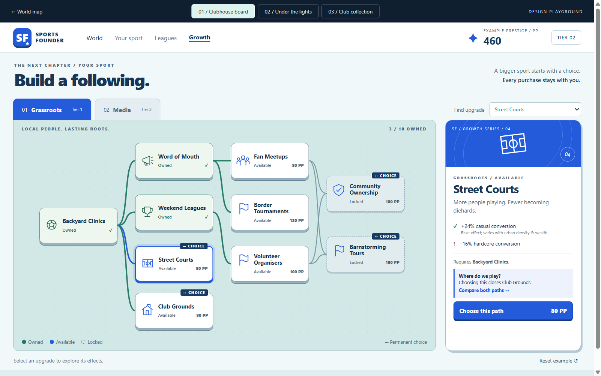
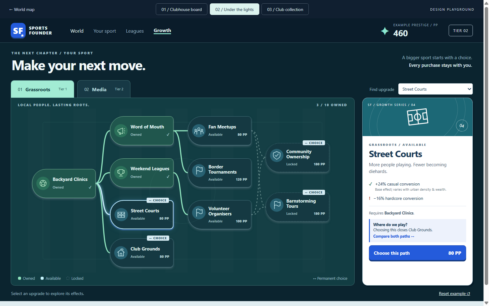
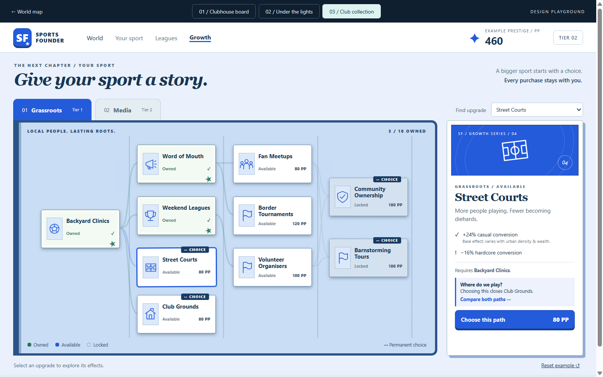
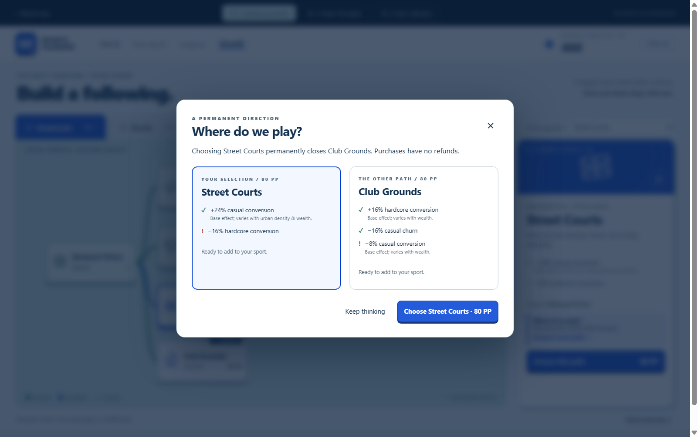

# Growth tree visual studies

**Selected direction: Clubhouse board**, chosen September 24, 2026. It is now the game's live
Growth screen. [See the production screen and behavior](production.md). The three studies below
remain available as design references.

[Open the interactive playground](index.html). It works offline: double-click the HTML file,
then use the three buttons across the top. These are alternative directions for the full-screen
Growth view, built on the accepted Matchday palette and Fresh Club typography.

All three share the same selection and example purchases. Switch between Grassroots and Media,
inspect any of the 20 upgrades, compare permanent fork choices, and try spending the example
budget. **Reset example** restores the starting state. The upgrade selector also gives keyboard
access to every node. On small screens, the board scrolls horizontally and the detail card follows
below it.

## 01 / Clubhouse board

[Open Clubhouse board](index.html#clubhouse)



The closest continuation of the world map: an aqua board, raised tiles, green owned paths, and a
cobalt decision card. Segoe UI throughout. The routes carry the structure; the card explains the
decision. **My starting recommendation** for its continuity with the main game screen and readable
upgrade paths.

## 02 / Under the lights

[Open Under the lights](index.html#floodlit)



A midnight stadium palette, pitch markings, bright connecting routes, and rounded tactical
markers. Lighter heading weight with the same Segoe UI family. A way to bring the cleaner parts
of the earlier Floodlights study into a more sporting setting. The white detail card keeps the
decision readable against the dark board.

## 03 / Club collection

[Open Club collection](index.html#album)



A blue club album with framed cards, stamped ownership, a tilted selection, and a collectible
detail card. Georgia appears only in the main and detail headings; controls stay in Segoe UI.
This borrows the collectible quality you liked in World Tour. The softer routes give the cards
more emphasis, but make the dependency structure less immediate than Clubhouse.

## The decision interaction



Ordinary upgrades can be purchased directly from their detail card. A fork opens this comparison
before spending: both alternatives, both sets of tradeoffs, and an explicit statement that the
other path closes permanently. Cancelling spends nothing. After choosing, the sibling stays
visible as a closed path so the tree records the sport's identity.

Locked nodes stay inspectable. The detail card states missing prerequisites, the required tier,
an earlier fork choice, or how much more PP is needed. Multiple prerequisites are all required.

[Media example](previews/media.png) · [Narrow layout](previews/narrow.png)

## What is real in these examples

The node names come from the game's English locale. Categories, base prices, prerequisites,
four exclusive forks, and effect amounts come from `content/growth-tree.yaml`. The study's
short flavor descriptions and initial scenario live in [study.yaml](study.yaml).

**This is a presentation fixture, not a recorded or live campaign.** It starts at example tier 2
with five owned upgrades and 460 PP. Prices are the content's base prices; the game's peak-tier
and Fandom Score multipliers are intentionally omitted here. Effect percentages are individual
base modifiers, not final stacked country outcomes. Country-dependent effects are marked.
Purchases affect only this page and reset on reload.

These HTML/CSS/SVG studies demonstrate screen composition and interaction. The production world
map remains Pixi. A chosen Growth presentation can use the existing React screen shell, worker
`applyAction({ type: "buyNode", nodeId })`, and snapshot prices and lock reasons. Production must
continue to use the simulation as the authority rather than adopting this fixture's purchase
logic. A map-style Pixi camera is available if the final growth board needs free pan and zoom;
these small examples use native scrolling.

Clubhouse has been ported to the live Growth screen, with localized effect descriptions and
campaign-derived prices, ownership, and eligibility. The alternate studies are not game themes.

## Regeneration and verification

From the repository root:

```powershell
node docs/growth-tree/build-data.mjs
npx.cmd biome check --write docs/growth-tree
node docs/growth-tree/capture.mjs
```

The capture command launches a hidden Electron window and saves the screenshots above. Its UI
checks cover all 20 nodes, switching looks and categories, both-prerequisite unlocks, fork
cancellation and purchase, excluded siblings, insufficient budget, and the upgrade selector.
It checks 1280×800 and 390×844 layouts and rejects remote requests and renderer console errors.
Screenshots may contain more physical pixels on displays with Windows scaling enabled.

Verified September 24, 2026: the Electron study checks passed with no renderer errors or remote
requests. `npm run check` passed all 686 tests across 20 files. An earlier unusually long run
timed out three simulation tests; a fresh full run passed in 232 seconds without code changes.
