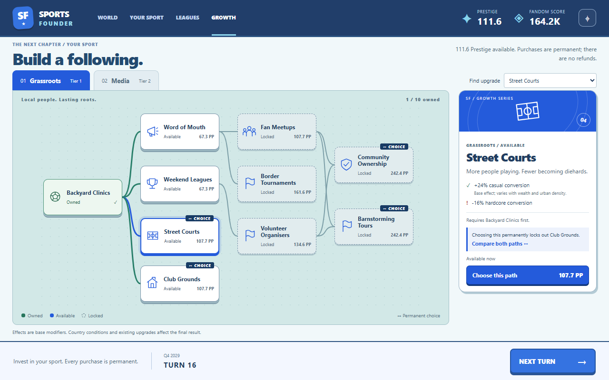
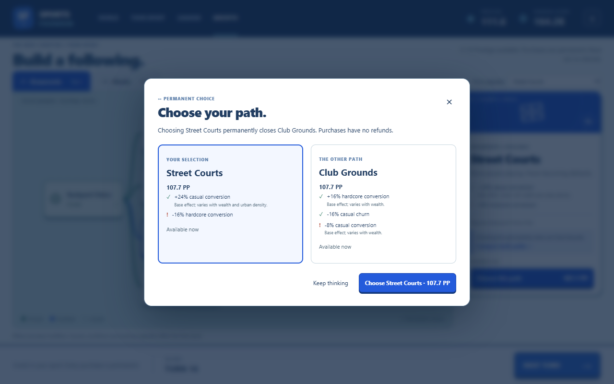

# Clubhouse growth board

Selected and implemented September 24, 2026. Run `npm.cmd run dev`, create a campaign, then
choose **Growth** in the top navigation.

The accepted aqua board, raised tiles, and cobalt detail card now run against the live simulation.
Grassroots and Media show all 20 upgrades. Connecting routes show prerequisites; selecting a
node highlights its incoming routes. Owned upgrades remain green, locked upgrades remain
inspectable, and closed fork alternatives remain visible as part of the sport's history.

The detail card shows the upgrade's base effects, explicit downsides, country conditions,
prerequisites, and the worker's current purchase price. Tile prices use compact formatting;
the detail card shows the full price to one decimal place. Prices include peak-tier and sport-size
scaling. Displayed effect percentages are individual base modifiers, not promises of final
country outcomes after stacking and conditions.

Ordinary upgrades buy directly. Permanent forks open a comparison showing both alternatives,
their effects, current prices, and eligibility. Cancel or Escape spends nothing. Confirm sends
the existing `buyNode` action through the worker. The worker remains authoritative for prices
and legality; the shared action guard prevents duplicate purchases and races with Next Turn.
Failed actions use the existing feedback and refreshed snapshot behavior.

**Next Turn** works from the board. Switching to World preserves the map's camera and country
selection, and returning to Growth preserves the selected upgrade. The category buttons and
upgrade selector are keyboard accessible. Narrow windows scroll the board horizontally and
place the detail card below it.

## Implementation

- `src/renderer/src/growth/` contains the React screen, SVG routes and pictograms, and styling.
  The world map remains Pixi. The growth board has no continuous rendering loop.
- `content/growth-view.yaml` contains the tile positions, dimensions and icon assignments,
  validated at load. Tests enforce coverage of the shipped node set, non-overlap, board bounds,
  and left-to-right prerequisite routes.
- `content/growth-tree.yaml` continues to own the mechanics and balance. Snapshots now expose
  base effect definitions and category unlock tiers alongside existing prices and lock reasons.
- English copy, flavor summaries, effect sentences, and status messages use i18next.
- The old Growth overview list is replaced. The sport and league overview dialogs remain.

Simulation rules, saved campaign state, dependency versions, and the selected world-map direction
are unchanged.

## Verification

The Electron smoke creates the configured Brazil campaign and exercises the real worker:
it earns enough Prestige for upgrades through Next Turn, buys Backyard Clinics, checks the Media
tier lock, cancels and then confirms a Street Courts fork, verifies the exact scaled cost is
spent once under a double click, and checks that Club Grounds is locked by that choice.
It also checks the map camera across navigation, the 20-node selector, and 1280×800 and 390×844
layouts. The existing setup, map and focus-action smoke checks run alongside these checks.

Screenshot and report output: `runs/growth-live-final/`.

Validation passed: `npm run check` (689 tests across 21 files), plus the complete Electron smoke
with zero renderer errors and zero remote requests. The live fork purchase cost 107.7139568481272
PP; the smoke checked the exact simulation deduction while the UI displayed 107.7 PP.
