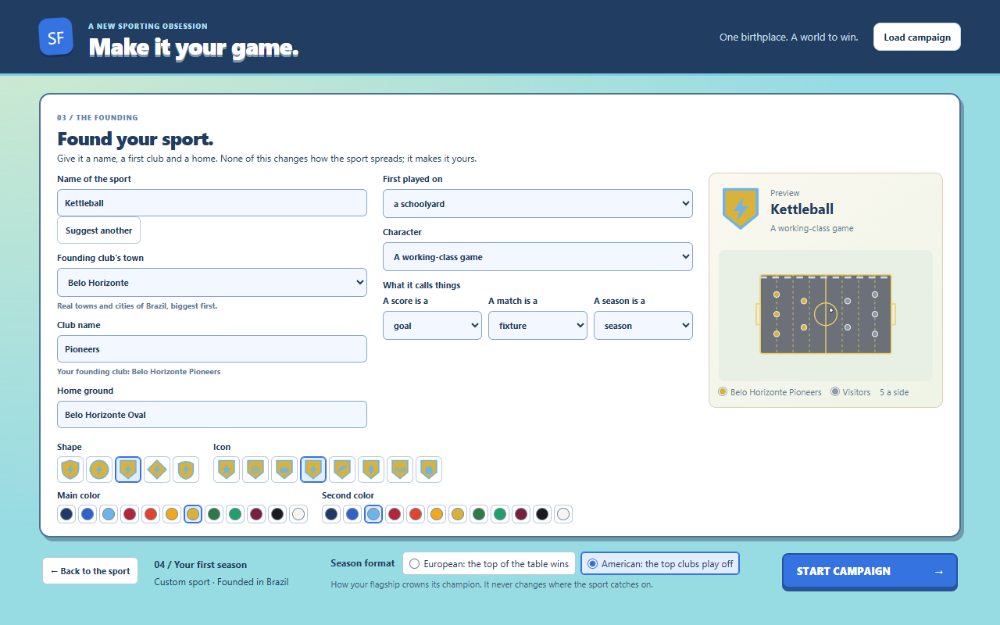
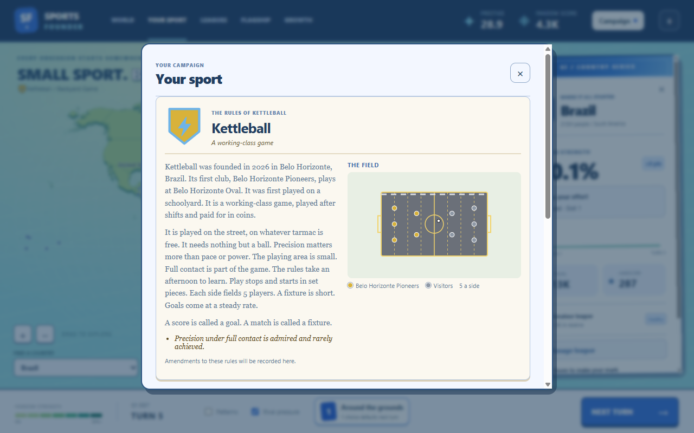
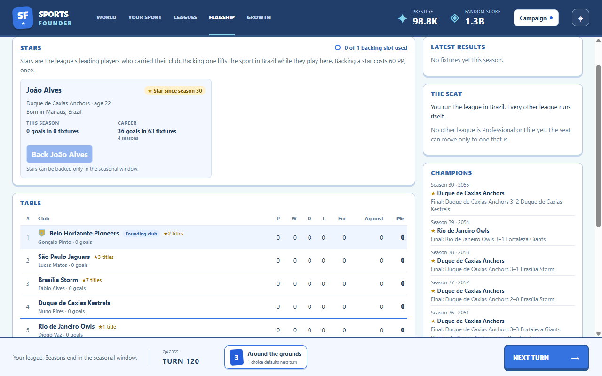

# Sport identity

Built October 4, 2026 (GDD v1.18, tech plan 2.8). The sport is named and founded at setup, and the
**Rulebook** under **Your sport** reads it back as an almanac page. None of it changes how the sport
spreads: identity never touches affinity, rates or random draws.

## The founding

Setup now has two pages, each fitting the window. The first is the birthplace and the sport, as
before. **Continue** opens the founding:

- **The sport's name**, generated from the seed (two name parts from `names.yaml`, "Kettleball"),
  editable, with **Suggest another**.
- **The founding club** is a real flagship club at the anchor: the player picks its town from the
  anchor's real places (biggest first) and names it. Its **home ground** defaults to the town and a
  ground word ("Belo Horizonte Park") and follows the town until the player edits it.
- **Founding character:** where it was first played (schoolyard, factory yard, beach, barracks
  square, village green, the docks) and its character (gentleman's, working-class, rebel or family
  game). Until Culture is built they color the rulebook only.
- **Terms:** what a score, a match and a season are called, from preset nouns (goal, point, run,
  try…; game, fixture, contest, bout; campaign, series, term). Each has singular, plural and title
  forms in the locale file, and templates use them only as nouns.
- **Emblem:** one of five shapes, eight icons and two of twelve colors (they must differ).

Names are trimmed and limited to 2–24 characters (sport), 2–20 (club) and 2–32 (ground); Start is
disabled with a hint until they fit. The simulation checks every choice again.

[Narrow layout](setup-founding-narrow.png)

## The Rulebook

The Rulebook opens **Your sport**: the emblem and name, the founding (year, town, club and
ground), where it was first played and its character, every genome trait as a sentence, the team
size in players a side (5 / 8 / 11), any renamed terms, and at most two deadpan lines for odd
trait pairings ("Innings on ice are slow, cold and, to their admirers, perfect."). The **field
diagram** is drawn from the genome: surface (grass stripes, an indoor court, tarmac, ice), footprint
(field size), team size (players a side), structure (goals at each end, set-piece lines, or a
central strip with fielders for innings), scoring frequency (goal size) and equipment (sticks, or
helmeted players in protective gear). The founding club plays in its main color; visitors are grey.
Rule amendments will be added here with rules evolution.

[Narrow layout](rulebook-narrow.png)

## Everywhere else

The emblem appears in the map's campaign line ("Kettleball / Backyard Game"), the flagship
heading and the founding club's table row, which is tagged **Founding club**. The flagship screen,
the Stars panel and the season and star cards use the sport's terms: "123 goals in 215 fixtures
over 14 seasons".

## Implementation and verification

Option lists live in `content/identity.yaml` (ids only, validated at load, including that odd
pairings name real genome options), name parts and ground words in `content/names.yaml`, limits in
`config.yaml` (`identity`). `src/sim/identity.ts` generates defaults from the seed on their own
random stream, validates a setup, founds the sport (the anchor's oldest club takes the chosen place
and name after the flagship is created, so no random draw changes) and builds the snapshot
(`TurnSnapshot.identity`, with resolved colors, odd pairings and players a side). The renderer's
`src/renderer/src/identity/` holds the emblem, the field diagram, the Rulebook, the setup panel and
the terms helper.

Save format 16 adds `GameState.identity`. Format 15 saves migrate to the seed's defaults, with the
anchor's oldest club founding the sport under its existing name; a format 15 save of a fresh
campaign migrates byte-identically to the same campaign started today with the default identity.

`tests/identity.test.ts` covers defaults and re-rolls, the founding club, every validation, the
renamed duplicate club, the untouched world and flagship, the snapshot, the save round-trip, the
15 → 16 migration and content validation. `npm run smoke` continues to the founding page, rejects a
one-letter name, names the sport Kettleball and its club Pioneers in the third town, picks goal and
fixture, a banner and a bolt, checks the ground follows the town and both pages fit, then opens
the Rulebook in both layouts (`runs/smoke/00-setup-founding.png`, `00-setup-founding-narrow.png`,
`02c-rulebook.png`, `02d-rulebook-narrow.png`). The star card it opens later reads in the sport's
terms.
