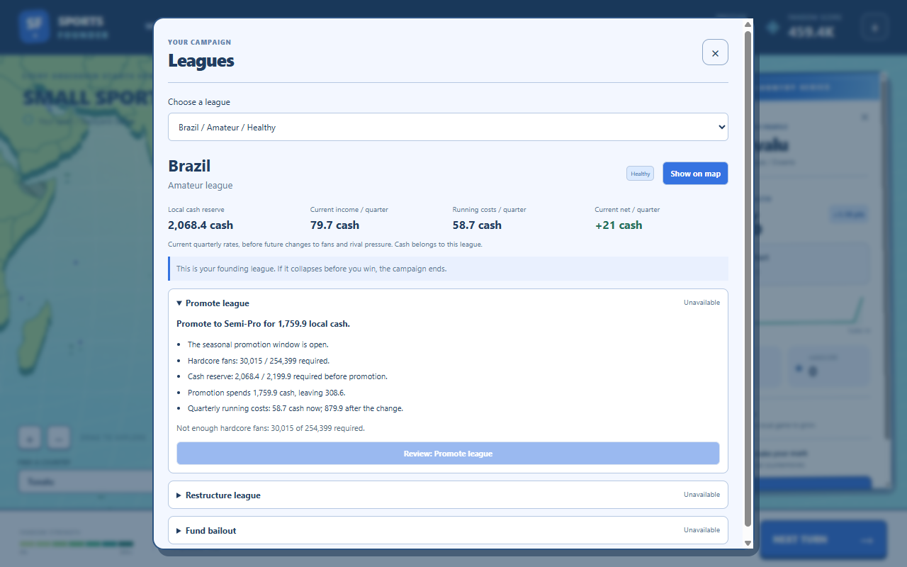
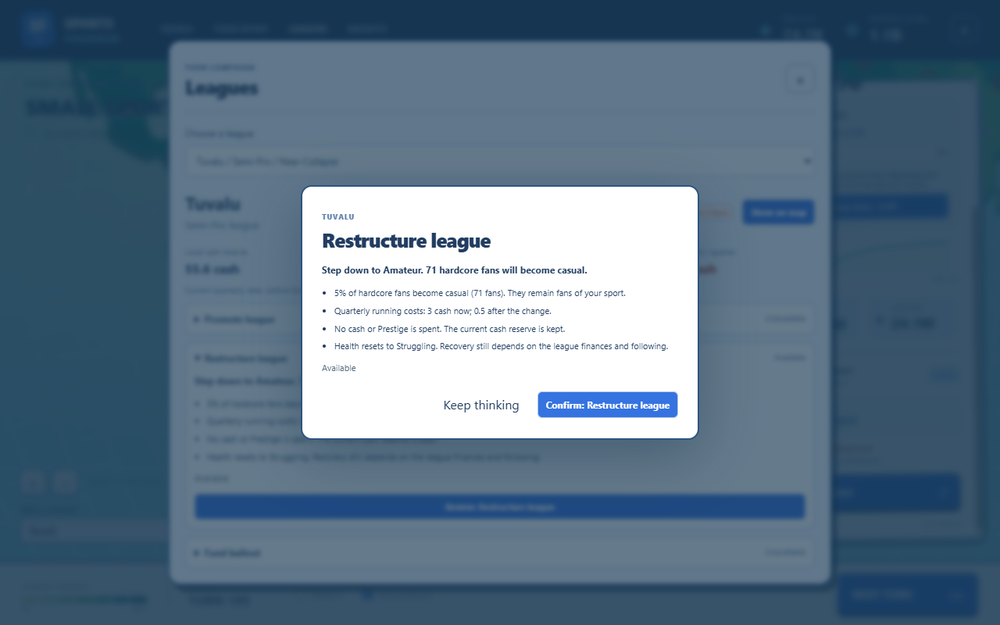

# League management

Implemented September 25, 2026. Run `npm.cmd run dev`, start a campaign, then open **Leagues** or
expand **Manage league** in a country card.

Choose any active league in the Leagues view. Both entry points use the same controls, current
financial figures, action quotes, and eligibility explanations. The financial summary shows
local cash, current quarterly income, running costs, and net income. These are current rates;
fans and rival pressure can change the next quarter's result. League cash is local, not pooled.

Expand an action to inspect its terms, then review and confirm it:

- **Promote league:** requires the seasonal window, enough hardcore fans, and the next tier's
  cash reserve. Shows the cash spent, remaining reserve, and new running costs. Promotion does
  not spend Prestige.
- **Restructure league:** available only at Near-Collapse and above Amateur. Shows the lower
  tier, the exact hardcore fans who will become casual, and the new running costs. Cash and
  Prestige are preserved; health resets to Struggling.
- **Fund bailout:** spends Prestige for local cash. Shows both balances after payment and the
  cooldown in quarters. A bailout adds cash immediately; health is evaluated at turn end.

Unavailable actions remain inspectable. Explanations cover the seasonal window, fan and reserve
thresholds, top/bottom tiers, health restrictions, insufficient Prestige, cooldown, and game over.
The founding league also shows the consequence of an anchor collapse before victory.

Cancelling or pressing Escape spends nothing. In the Leagues view, Escape closes the confirmation
while keeping league management open. All three actions use the existing worker action endpoint
and shared in-flight guard; duplicate clicks cannot spend twice or advance the turn.

[Country-card controls](country-card.png) · [Bailout confirmation](bailout.png)

## Implementation and verification

`src/sim/league-actions.ts` supplies structured quotes and blockers to both `checkAction` and
country snapshots. The UI translates these blockers rather than parsing engine error text or
reimplementing eligibility. Prices, thresholds, cooldowns and fan-loss rates still come from
content. The existing simulation rules and saved campaign format are unchanged.

Unit tests check action eligibility across tiers, health states, windows and budgets, as well as
the exact promotion deduction, restructuring fan loss, bailout transfer and cooldown. Existing
league simulation tests continue to exercise the rules independently of the new snapshot fields.

The Electron smoke grows Tuvalu naturally in the existing seeded campaign, promotes its league,
funds a bailout when it struggles, then restructures it at Near-Collapse. Each action is cancelled
first and then confirmed under a double click. The smoke checks exact cash/Prestige/fan changes,
unchanged turn, the bailout cooldown, both entry points, and desktop and narrow layouts.

Smoke output: `runs/leagues-final/`. The broader setup, map, growth and focus checks run first.

Validation passed: `npm run check` (694 tests across 22 files) and the complete Electron smoke,
with zero renderer errors or remote requests. The live scenario paid 6 local cash to promote,
25 Prestige for a 24-cash bailout, then demoted 71 hardcore fans during restructuring while
preserving cash and Prestige. Every confirmation was cancelled first and applied only once.
