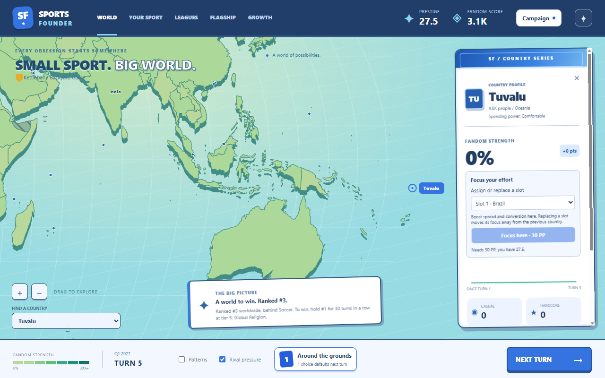

# Big and rich markets

Built October 4, 2026 (GDD v1.21). Every sport wants the population giants; the game does not stop
that, it makes the giants and the rich markets play differently.

- **A giant is many audiences.** Genome fit in a country (every option's lever deltas, and so the
  setup hints and amendment hints too) is × min(1, (50 million ÷ population) ^ 0.3), never below
  0.3. India's fit is about a third of a mid-sized market's, the US's about two thirds; countries
  under 50 million are untouched. Giants are won by breadth and patience.
- **Wealth levels.** Every market has a spending power: **Shoestring, Modest, Comfortable** or
  **Affluent** (shown on the country card). The income per person in the data is the World Bank's
  GNI per capita (Atlas method, 2024), the measure it classifies countries by, so the levels are
  its FY2026 income groups (thresholds $1,135, $4,495, $13,935): 24 markets and 0.7 billion people
  Shoestring, 49 and 3.2 billion Modest, 53 and 2.8 billion Comfortable, 87 and 1.4 billion
  Affluent. The US and Germany are Affluent, China and Brazil Comfortable, India and Nigeria
  Modest.
- **Wealth weighs Prestige.** PP income counts each market's Fandom Score × its level's weight
  (0.5 / 0.75 / 1 / 1.5). With income's diminishing returns, the same fans earn about 41% more
  Prestige in an Affluent market than in a Modest one. The race for #1 still counts raw fans.
- **Rivals fight hardest where it matters most.** A market's value to rivals is (population ×
  wealth weight ÷ 50 million) ^ 0.15, clamped to 0.67–1.5: it divides their escalation thresholds
  there, and among fronts at the same level they spend first where their wealth-weighted hardcore
  base is biggest.

## Balance

Measured with `--experiment pacing` (builder, 12 typical anchors × 6 seeds, 200 turns). The
rich-market defense made the #1 contest harder (75% of campaigns lost #1 before the win), so the
rival world championships were scaled back (casual × 1.12, hardcore × 1.4, home + 1.2%; about a
0.75% lift) and the market value softened, giving 37 of 70 (53%). First win median turn 163–169;
pacing passes.

Genome differentiation is now judged on the sports as invented (bots that never amend): 5 of 6
preset pairs pass, as before (street court vs long innings shared 6.0 top markets before this work
too). The same pairs with amendments share 3.8–7.2: reported, not judged, since every sport
adapting toward the same giant markets is natural.

## Implementation

Config: `bigMarkets`, `wealthLevels`, `rivalAI.marketValue`. Derived per country at load:
`fitScale` and `wealthLevel` (`src/content/derive.ts`). `fitScale` applies in `leverMultipliers`
and `optionNetDelta`; Prestige weights in `quarterPpIncome` (`src/sim/quarter.ts`); rival market
value in `src/sim/rivals.ts`. `tests/markets.test.ts` covers the levels, the Prestige weights, the
softening and the market value.
