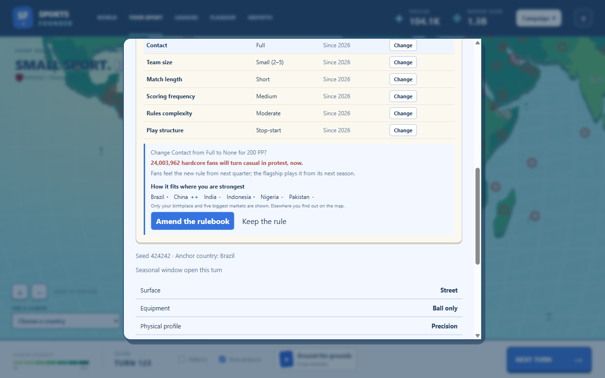
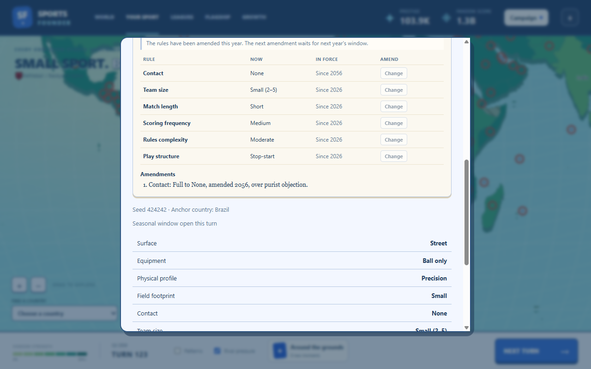

# Rules evolution

Built October 4, 2026 (GDD v1.20, tech plan 2.9). First build: the player's own amendments.
Proposals from broadcasters, sponsors and league directors come with the deals build.

Open **Your sport**: below the Rulebook, **Amend the rules** lists the six rule traits (contact,
team size, match length, scoring frequency, rules complexity, play structure), each with its
option and the year it has stood since. Identity traits (surface, equipment, physical profile,
footprint) never change.

- **When:** in the seasonal window, one amendment per in-game year. Outside the window, or after
  this year's amendment, the controls are disabled and the status line says why.
- **What:** one trait, to any of its options. The size of the change is its **jump**: steps between
  options (none → full contact is 2), and 2 for any change of play structure.
- **Price:** 100 PP × the peak tier's cost multiplier × the jump, once.
- **Purist backlash:** in every country a share of your hardcore fans turn casual, at once:
  3% × jump × the rule's age (full at 40 years), doubled in the anchor, raised where the old option
  suited fans better than the new one (× 1 + 2 × the fit lost), capped at 25%. A rule a few months
  old costs almost nothing; amending one that has stood for decades is a real loss (the smoke
  campaign's 30-year-old contact rule cost 24 million hardcore fans).
- **Before confirming** the review shows the price, exactly how many hardcore fans will turn
  casual, when the change takes effect, and +/− fit hints for the anchor and your five biggest
  markets. Elsewhere you find out on the map.
- **Timing:** fans and spread feel the new rule from the next quarter; the flagship plays it from
  its next season (its scoring rule is fixed at each season's start).

The Rulebook's prose always describes the current rules, and **Amendments** lists every change
with its year ("Contact: Full to None, amended 2056, over purist objection").

## Balance

Bots: the builder amends when a change's fit gain across its markets (weighted by Fandom Score)
beats the share of hardcore fans it would lose by a margin; other bots never amend. In the pacing
experiment (builder, 12 typical anchors × 6 seeds, 200 turns) it amended a median 3–4 times per
campaign, first around turn 45; typical amendments cost a few thousand hardcore fans, late ones
millions.

Amending made the leader pull clear faster: #1 lost before the win fell from 53% to 34% of the
campaigns that reached it. Rival world championships were strengthened one step (casual × 1.26,
hardcore × 1.9, home + 2.6%; about a 1.6% lift of soccer's world Fandom Score), which brought it
back to 34/68 (50%). First win median turn 167–170 (target 180 ± 30%); pacing passes.

## Implementation and verification

`src/sim/rules.ts` holds the jump, price, blockers, backlash, the amendment itself, the bot-free
preview and the snapshot (`TurnSnapshot.rules`). Every number is config (`rulesEvolution`). The
`amendRule` action goes through `applyAction`; each amendment is in `GameState.rules` and a
`ruleAmended` landmark. Save format 17; format 16 saves migrate with no amendments, every rule
standing since the start. A save whose genome disagrees with its last amendment is rejected.
The screen is `src/renderer/src/identity/AmendRules.tsx`.

`tests/rules.test.ts` covers jumps, price, every blocker, the amendment's effects (genome, PP,
record, landmark, hardcore → casual matching the preview), backlash by age and in the anchor, the
flagship's next-season timing, the review snapshot, save round-trip, the 16 → 17 migration and a
tampered save. `npm run smoke` amends a rule late in the campaign through the review step and checks
the dated amendment (`runs/smoke/41-amend-review.png`, `42-amendments.png`).
