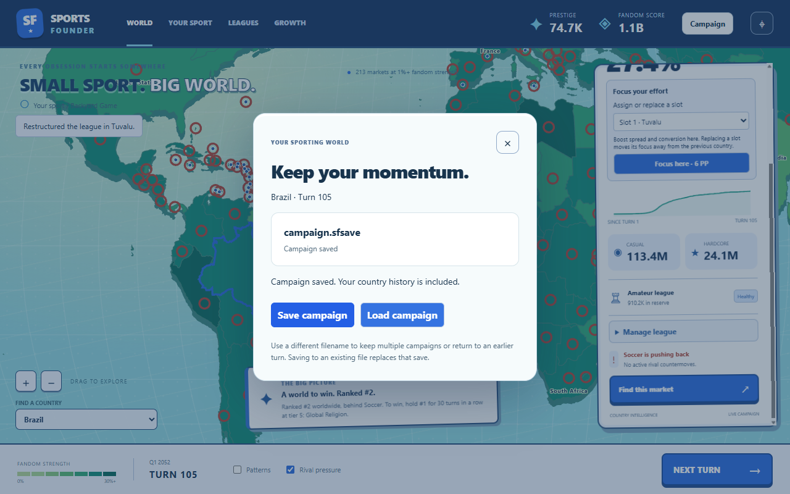
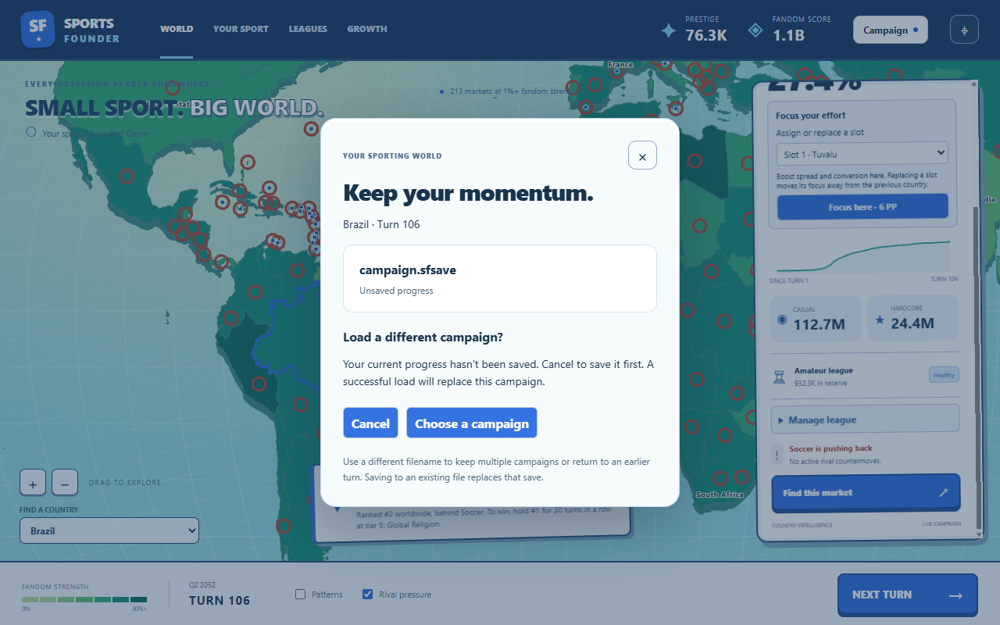

# Campaign save/load

Implemented September 26, 2026, in the current Clubhouse / Matchday direction.

Open **Campaign** in the top bar, then **Save campaign** or **Load campaign**.
The setup screen also offers **Load campaign** before starting a new game.

[Setup loading screen](load-from-setup.png) · [Narrow layout](narrow.png)

Choose a filename in the system file picker. Different filenames keep independent campaigns
or earlier turns; choosing an existing filename uses the OS overwrite confirmation. There is
no fixed slot limit. These are manual local saves; autosave and Steam Cloud are not implemented.

An unsaved campaign is marked by a blue dot. Loading another campaign first asks whether to
replace unsaved progress. Cancelling the menu or file picker leaves it alone. Closing the game
with unsaved progress offers **Stay in game** and **Leave without saving**; save from the
Campaign menu before leaving. Actions and turns are blocked while a file operation is pending.

## What a save carries

- Complete simulation state: seed and RNG, genome, fans, money, focus slots, growth choices,
  leagues, tier progress, rival budgets and countermoves, cooldowns, win/outcome and landmarks.
- Retained sparkline history for every country (up to the content-defined 160 turns).
- The pinned country. Map camera and visual overlay preferences reset on an app restart.

Loading resumes at the same turn. It does not advance time or regenerate the campaign.
Within a turn, actions replace the latest history point rather than adding a fictional turn.

## File and process boundaries

`.sfsave` is gzip-compressed JSON using Node's built-in zlib. No dependency was added.
Session format **1** contains `campaign`, `history` and `selectedCountryId`. The campaign
keeps the existing simulation format **6** and its migrations from formats 1–5. Future
session shape changes need their own migration; unknown future versions are rejected.
Plain JSON simulation saves remain importable; their missing presentation history starts at
the loaded turn instead of reconstructing observations that were never recorded.

The worker validates the entire file, checks simulation invariants against current content,
checks history chronology and country IDs, and builds the snapshot before replacing its state.
Invalid input leaves the current campaign unchanged. Lost worker acknowledgements block play
against potentially stale state; reopening a valid save can recover it.

The sandboxed preload exposes only save/open operations and close-state reporting. The
renderer cannot choose arbitrary filesystem paths or invoke arbitrary IPC. The main process
checks the sender and owns native file pickers, compression and file I/O. Files are bounded to
64 MiB before and after decompression. Writes use an exclusive temporary file in the destination
directory, flush and close it, then rename over the destination. A failed replacement preserves
the existing save and removes the temporary file when the filesystem permits cleanup.

## Verification

`npm.cmd run check` covers session round trips, legacy import, unsupported versions,
incompatible countries, malformed history, rejected loads, file failures, pending-operation
guards and deterministic continuation. File tests exercise actual creation/replacement,
compression, truncated archives, and an injected rename failure with an existing save.

The full suite passed **704 tests across 24 files**, with type checking and purity checks.
Changed TypeScript/CSS files pass Biome; earlier HTML studies still emit their existing
non-blocking lint warnings.

A subsequent verification run experienced a multi-hour wall-clock gap: 702 tests passed,
while the existing Turkmenistan and United Arab Emirates turn-loop cases hit their 120-second
timeouts. Both passed on an isolated rerun in 4.18 seconds; no assertion failure remained.

`npm.cmd run smoke -- runs/save-load-final` exercises the real UI, preload, IPC, worker and
disk. Only the native pickers and exit-question response are substituted for unattended testing.
It saves a naturally played campaign after league promotion, bailout and restructuring,
checks cancellation/failure, reloads the renderer to create a fresh worker, loads the disk file,
and compares both the restored session and next turn byte-for-byte with uninterrupted play.
It also checks unsaved-close protection, records screenshots at 1280×800 and 390×844, and
rejects renderer errors or remote requests.

The turn-105 smoke save contains 1,685,176 bytes of JSON and occupies **382,691 bytes** on
disk (77% smaller). The restored session and turn-106 continuation matched exactly, including
country history. The run reported zero renderer errors and zero remote requests.

The reload check exposed a Pixi initialization race: camera reset can deliver a React update
while `Application.init()` is pending. The map now waits for the initialized context before
creating its viewport. The existing geometry, map renderer and dependency versions are unchanged.

Next Phase 0 system: events and player decision cards.
