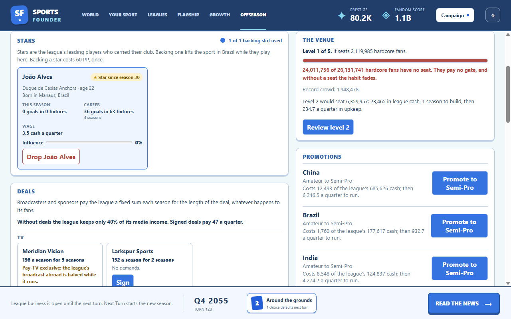
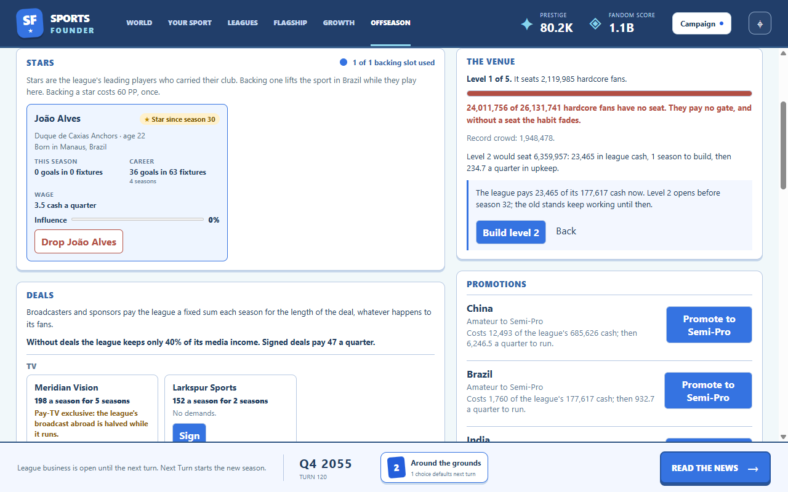

# Venues and payroll

Built October 7, 2026 (GDD v1.30, tech plan 2.17). Run `npm.cmd run dev`, play to the first
offseason, then open **Offseason** in the top bar.

The flagship's league has a venue level from 1 to 5; there are no individual stadiums. Every other
league stays at level 1, uncapped, on the simple model. Youth programs, standing policies and
ticket pricing are parked (GDD parking lot).

- **The gate cap:** at the seat, gate is paid only on hardcore fans the venue seats. Capacity is a
  share of the population: 1%, 3%, 8%, 15% and 30% for levels 1–5, keyed to the hardcore shares
  anchors actually reach (Semi-Pro 0.5–2%, Professional 3–5%, Elite 5% rising to 15–36%).
- **Building:** the next level is bought with league cash in the offseason, one at a time, and
  opens when the offseason closes 1, 2, 2 or 3 seasons later (levels 2–5); the old stands keep
  working meanwhile. A level costs 4, 8, 14 or 20 quarters of the running cost of the tier it
  serves (level 2 Professional, 3 and up Elite), or of the league's own tier if higher, so a small
  league cannot build a big venue cheaply. Each level above 1 adds upkeep (4% of its cost basis a
  quarter).
- **Promotion needs the venue:** at the seat, Semi-Pro, Professional and Elite need levels 1, 2
  and 3. Without this the naive bot promoted past its capacity and folded the anchor (Austria: 6
  of 8 seeds; with it, none). Promotion reviews show the income at the new tier with today's fans
  and venue, and warn when it falls short of the costs.
- **Fans:** each level lifts hardcore conversion in the seat country by 4%, fading while fans
  overflow the seats (no seat, no habit).
- **Culture:** the record is the best season crowd; beating it by 10% is a record crowd, one more
  fame fact for the champion's ground (or the final's host). Opening level 4 or 5 modernizes the
  grounds and betrays every famous venue in the country, as naming rights do.
- **Moving the seat:** a level stays with its country's league; a new seat starts where its own
  venue stands, and the old one keeps its level (and upkeep) for a return.
- **Payroll:** the flagship's running cost is split into operations and a payroll baseline (30%,
  the same total for a league without stars); each star playing there draws a wage of 6% of the
  running cost a quarter, rising 15% for every season as a star after the first and up to 50% with
  backed influence. A wage ends at retirement or a move. Wages never come from skill.

Building happens only on the offseason screen; the Flagship tab shows the venue read-only. League
finances list operations, payroll, star wages and upkeep; the Stars panel shows each wage. News: a
level opening (a toast), a modernizing level (a big moment), a record crowd (a toast naming the
ground).

[Narrow layout](narrow.png)

## Implementation and verification

`src/sim/venues.ts` holds capacity and the conversion lift; `src/sim/venue-actions.ts` the terms,
blocker, the `buildVenue` action and `openVenues` (run by `closeOffseason`); `src/sim/league-costs.ts`
every league's costs (`leagueCosts`, used by the quarter step, quotes, the snapshot and bots);
`venueCostBasis` and `venueUpkeep` in `src/sim/leagues.ts`; the gate cap in
`leagueIncomePerQuarter` (`src/sim/deals.ts`); star wages (`starWage`) and record crowds in
`src/sim/flagship.ts`; modernization (`modernizeGrounds`) and record-crowd fame in
`src/sim/culture.ts`; news in `src/sim/venue-cards.ts`. Save format 22. Every number is
`leagues.venue` and `flagship.payroll` in `content/config.yaml`.

`tests/venues.test.ts` (14 tests) covers capacity, crowds, the migration, the cap, the cost split,
wages, building and opening, the conversion lift, modernization, record-crowd fame, the promotion
gate and the news. `npm run smoke` builds a level on the offseason screen through the review and
checks the narrow layout and the read-only Flagship card (`runs/smoke/51-venue.png` to
`54-venue-narrow.png`).

**Measured** (builder, 12 typical anchors, seeds 1–3, 200 turns): pacing passes pooled (tier 2 at
turn 33, tier 3 at 44, tier 4 at 76, tier 5 at 122.5, first win at 161; before venues 33, 43.5,
76.5, 120, 158); #1 lost before the win 20/36 (56%, unchanged); the flagship never reached
Near-Collapse. The cap cost the seat 6% of its gate on average (up to 32% in one campaign); the
venue stood at level 1 through Semi-Pro, 2 at Professional and 5 for most of Elite; two levels a
campaign modernized; payroll was 25% and star wages 7–8% of the seat's costs. Venues made more
grounds famous, lifting the Elite deal slate to 122%; naming rights and the third sponsor slot
were trimmed, and it measures 120% (the top of its band) on seeds 1–2. The naive greedy-spread bot
from Austria (8 seeds) never collapsed, reaching tier 5 at turn 102.5 as before venues.
