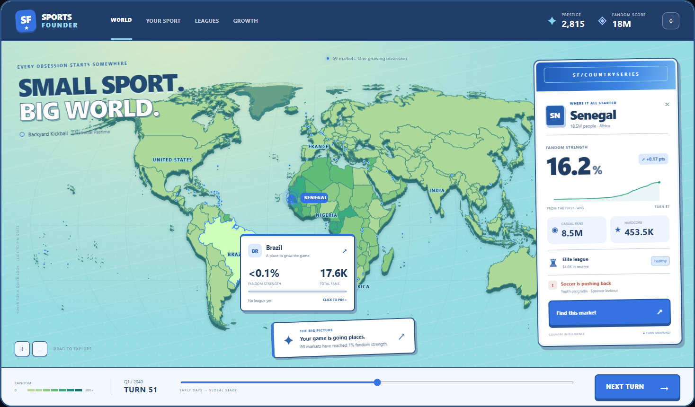

# World map

[**Open the current preview**](index.html) · [Implementation brief](brief.html) · [All project docs](../README.md)

## Current direction: Matchday + Fresh Club

Accepted on **2026-09-23** as the working visual direction. This is a starting point for the playable screen, open to refinement as we use it in the game.

- **Clubhouse world:** raised coastlines, natural green land and aqua ocean.
- **Matchday palette:** cobalt controls, a navy header and white cards.
- **Fresh Club typography:** clean Segoe UI lettering for headings, country names and stats.
- **Collectible country cards:** a blue country-series band, defined borders and physical shadows, with compact hover previews and pinned details.

Keep the map prominent and the interface tactile. Avoid the SaaS dashboard feel of Floodlights, beige surfaces, and most of World Tour's poster styling. The collectible treatment is a visual choice; it does not imply a card-collection mechanic.

The preview runs locally with real recorded campaign snapshots. Hover, country selection, pan, zoom and turn playback work; it is still a documentation prototype, not the live game screen. Colours, typography, card details and spacing can evolve during implementation. Layout and information hierarchy should be judged in a playable screen.

## Live game implementation

The main screen now uses **PixiJS**, following the confirmed renderer decision.
[View the live-game screenshots, implementation notes and verification commands](production.md).
Launch it with `npm.cmd run dev` from the project root.

## Earlier studies

Retained for reference and comparison; the current direction above takes precedence for visual styling.

| Study | Contents |
| --- | --- |
| [Clubhouse refinements](studies/clubhouse.html) | The selected combination plus Fresh Club, Poolside, Matchday and Club Edition |
| [Initial directions](studies/directions.html) | Floodlights, original Clubhouse, World Tour and Broadcast |
| [Initial direction playground](studies/directions-playground.html) | Interactive versions of those four directions |
| [Atlas prototype](studies/atlas.html) | Earlier almanac/night themes, full market selection and recorded replay |
| [Atlas implementation notes](studies/atlas.md) | Brief review, metric definitions, geography coverage and reproduction commands |
| [Tile prototype](studies/tiles.html) | Original equal-area tile reference and its separate recorded campaign |

## Folder guide

- `index.html`: the current interactive direction, with the Clubhouse variations available for comparison.
- `brief.html`: the original implementation brief.
- `studies/`: earlier visual explorations and technical notes.
- `assets/`: shared styles, scripts, replay data, geography coverage and [third-party notices](assets/THIRD-PARTY-NOTICES.txt).
- `assets/previews/`: screenshots and card close-ups.

The replay exporter is [scripts/build-map-example.ts](../../scripts/build-map-example.ts); the atlas screenshot helper is [scripts/capture-map-example.cjs](../../scripts/capture-map-example.cjs). Both use this folder structure.
