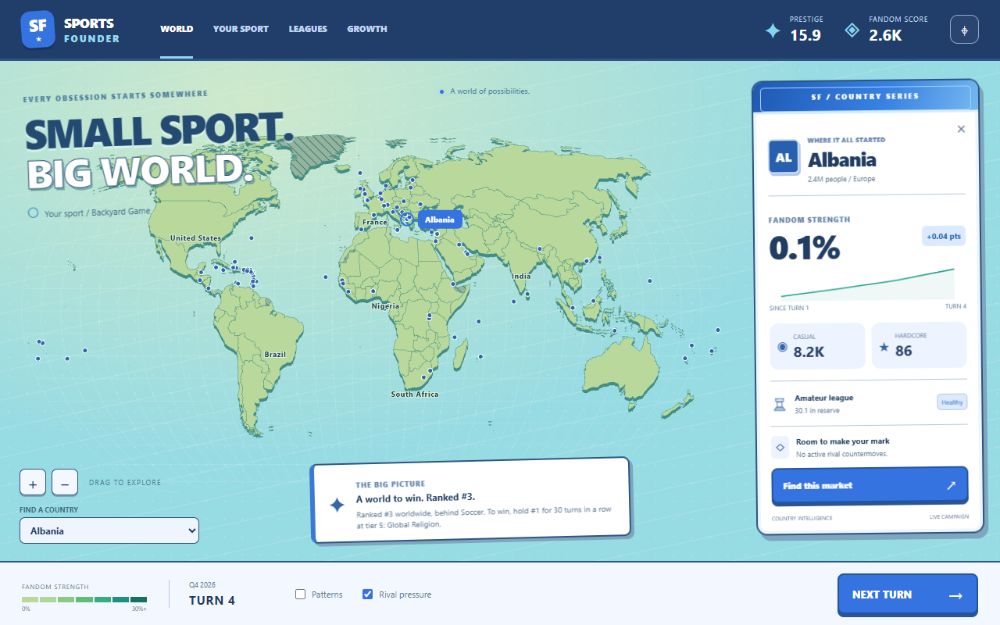
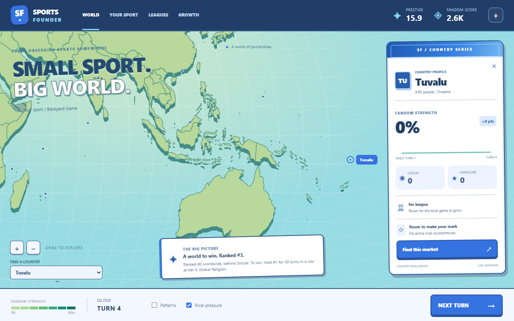

# Live Pixi main screen

The September 23 implementation replaces the placeholder main screen with the selected
Clubhouse / Matchday / Fresh Club direction. **PixiJS renders the map; React and CSS render
the controls and country cards.** The SVG studies remain visual references.

Run `npm.cmd run dev` from the project root to play it. The startup campaign retains the
existing worker's default sport preset and Albania anchor.

## Working now

- Raised natural land, aqua ocean, neutral hatching, content-defined fandom bands,
  optional patterns and rival-pressure markers.
- Pan, wheel/pinch zoom, zoom buttons, home view, hover previews, pinned country cards,
  locate action, and a keyboard-accessible selector for every market.
- Prestige, Fandom Score, league status, rival information and the objective come from
  the live simulation. Next Turn calls the existing worker.
- Country sparklines and trend pills use actual session history. Chart spacing reflects
  elapsed quarters, including turns whose duration changes with prestige tier.
- Your Sport, Leagues and Growth open read-only campaign overviews. They preserve access
  to the placeholder screen's information; buying growth nodes is a separate screen task.

## Architecture and future changes

The map uses exact-pinned PixiJS 8.21.0, @pixi/react 8.0.5 and pixi-viewport 6.0.3.
Projected polygons are built offline and committed. The renderer creates retained map
layers once, then changes fills when snapshots arrive. Camera and selection changes
request a frame; there is no continuous animation loop while idle.

Map layers separate land depth, faces, borders, rival signals, selection and labels.
Future turn effects can use these Pixi layers without replacing the map or moving the
HTML cards into canvas. Animated recaps, particles and transitions are not implemented yet.
Visual tokens remain in `src/renderer/src/styles.css`; this direction remains revisable.

Heat thresholds, camera settings and history retention live in `content/map.yaml`,
validated through Zod. History is bounded to 160 snapshots per country and resets with
the session. It is not saved yet. There is no recorded replay slider in the live game.
The simulation and its save format are unchanged.

See [geometry provenance and reproduction](../../assets/map/README.md), including the
documented build-only dependency advisory and the complete coverage manifest.

## Verification

`npm.cmd run check` runs type checking, Biome, purity checks and the full test suite.
`npm.cmd run smoke` builds and runs Electron, advances three real turns, exercises all
213 selector entries, physically hovers/clicks Brazil and Tuvalu, drags and wheel-zooms
the canvas, toggles overlays, checks the card layout, and opens/closes the nav dialogs.
It saves 1280 by 800 screenshots and also checks a narrow viewport for horizontal overflow.

The smoke report records renderer errors and remote requests; neither is expected.
On September 23, `npm run check` passed all 673 tests and the final Electron smoke passed
with zero renderer errors or remote requests. It also confirmed that the idle map stops
requesting frames. The final report and additional screenshots are in the local, ignored
`runs/pixi-map/final/` folder.
This is desktop functional verification, not a Steam Deck performance certification or
a completed controller-accessibility pass.
