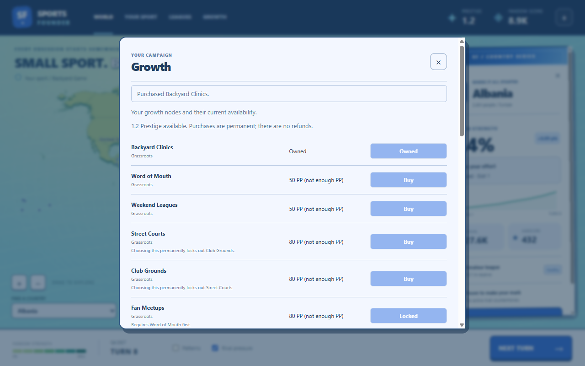
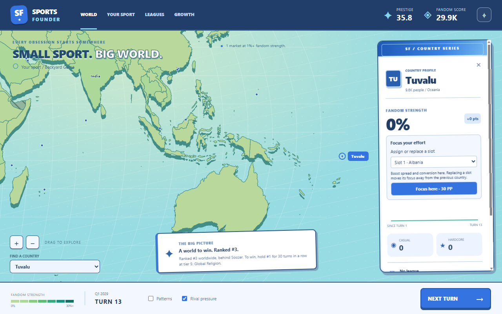

# Live Pixi main screen

The September 23 implementation replaces the placeholder main screen with the selected
Clubhouse / Matchday / Fresh Club direction. **PixiJS renders the map; React and CSS render
the controls and country cards.** The SVG studies remain visual references.

Run `npm.cmd run dev` from the project root to play it. The startup campaign retains the
existing worker's default sport preset and Albania anchor.

## Working now

- Raised natural land, aqua ocean, neutral hatching, content-defined fandom bands,
  optional patterns and rival-pressure markers.
- Pan, wheel/pinch zoom, zoom buttons, home view, hover previews, pinned country cards,
  locate action, and a keyboard-accessible selector for every market.
- Prestige, Fandom Score, league status, rival information and the objective come from
  the live simulation. Next Turn calls the existing worker.
- Country sparklines and trend pills use actual session history. Chart spacing reflects
  elapsed quarters, including turns whose duration changes with prestige tier.
- **Growth** now buys nodes at their live price. It shows prerequisite and tier locks,
  affordability, and the permanent alternatives lost when choosing a fork.
- Select a country, choose a slot in **Focus your effort**, and assign it at the displayed
  Prestige cost. Existing assignments are explicitly replaced. **Your sport** lists the
  current slots and lets you choose which to give up after a demotion.
- **Leagues** remains an inspection view. Campaign setup, a full growth-tree layout,
  league-management controls, save/load and events are later work.

## Architecture and future changes

The map uses exact-pinned PixiJS 8.21.0, @pixi/react 8.0.5 and pixi-viewport 6.0.3.
Projected polygons are built offline and committed. The renderer creates retained map
layers once, then changes fills when snapshots arrive. Camera and selection changes
request a frame; there is no continuous animation loop while idle.

Map layers separate land depth, faces, borders, rival signals, selection and labels.
Future turn effects can use these Pixi layers without replacing the map or moving the
HTML cards into canvas. Animated recaps, particles and transitions are not implemented yet.
Visual tokens remain in `src/renderer/src/styles.css`; this direction remains revisable.

Heat thresholds, label markets, camera settings and history retention live in `content/map.yaml`,
validated through Zod. History is bounded to 160 snapshots per country and resets with
the session. It is not saved yet. There is no recorded replay slider in the live game.
Simulation rules and the save format are unchanged. Country snapshots now carry the actual
focus price, calculated by the simulation from organic exposure and owned growth nodes.

Actions use the worker's `applyAction` endpoint and return a fresh snapshot immediately.
The store serializes actions and turns, preventing double spending from rapid clicks.
Rules rejections return an unchanged campaign and a fresh snapshot; they do not halt play.
An unexpected worker failure stops further spending against potentially stale data.
Action snapshots replace the current history point instead of inventing an extra turn.

The headline is compact enough to clear North America in the 1280 by 800 world view.
The unused band-zero pattern texture and App.tsx BOM were removed. Geometry bounds use a
reduction rather than argument spreads, so increasing simplification detail cannot overflow
the JavaScript argument stack. The committed geography is unchanged.

Load-time Zod geometry validation measured **5.3 ms** in the first Electron action smoke on
this machine. It remains enabled; this one measurement does not justify removing the check.
The smoke report records `geometryValidationMs` for subsequent comparisons.

See [geometry provenance and reproduction](../../assets/map/README.md), including the
documented build-only dependency advisory and the complete coverage manifest.

## Verification

`npm.cmd run check` runs type checking, Biome, purity checks and the full test suite.
`npm.cmd run smoke` builds and runs Electron, advances three real turns, exercises all
213 selector entries, physically hovers/clicks Brazil and Tuvalu, drags and wheel-zooms
the canvas, toggles overlays, checks the card layout, and opens/closes the nav dialogs.
It also earns Prestige through real turns, buys a node, checks a rapid double click spends
once, assigns focus to Tuvalu, and verifies the assignment survives the next turn. Decisions
must deduct the quoted cost without advancing the turn or adding history points.
It saves 1280 by 800 screenshots and also checks a narrow viewport for horizontal overflow.

The smoke report records renderer errors and remote requests; neither is expected.
The action pass passed **681 tests across 19 files**, along with type checking, Biome and
purity checks. Worker-boundary and store tests cover spending, rejections, slot replacement,
demotion slot choices, and pending-operation guards. The final Electron smoke passed with
zero renderer errors and remote requests; its report and additional screenshots are in the
local, ignored `runs/actions/final/` folder. It also checks that the idle map stops requesting
frames. The final geometry-validation measurement was 5.6 ms.
This is desktop functional verification, not a Steam Deck performance certification or
a completed controller-accessibility pass.
