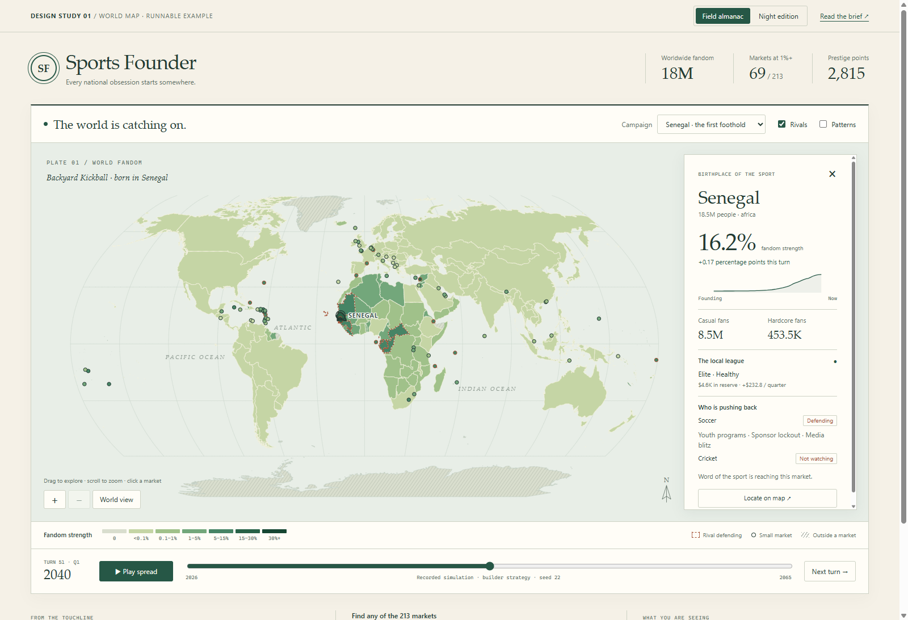
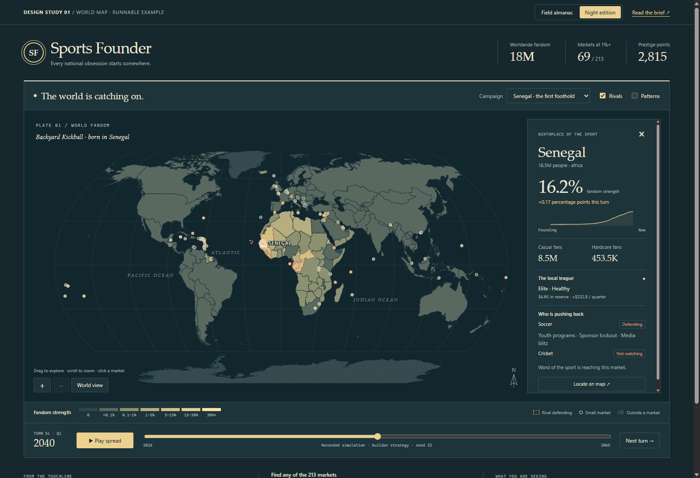
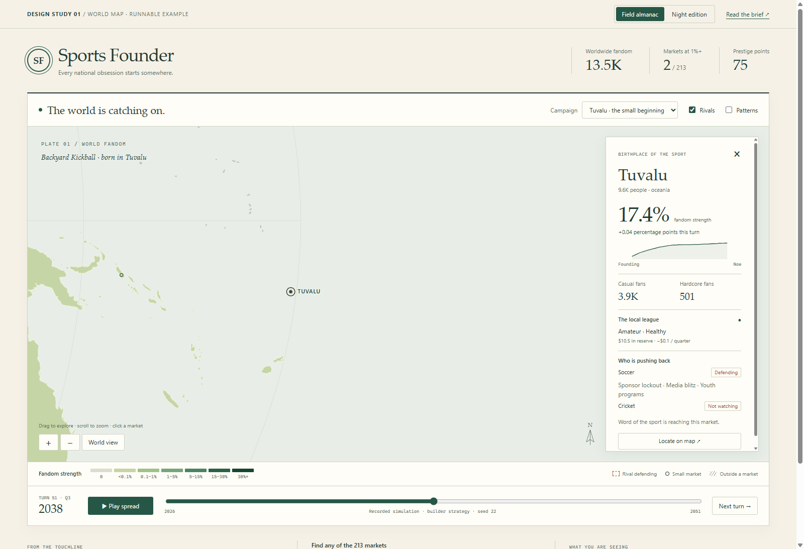

# Earlier atlas study

Visual reference only. [Matchday + Fresh Club](../index.html) is the current direction; see the [decision notes](../README.md). The metric, geography and implementation notes below remain useful.

[**Open the interactive atlas**](atlas.html) · [Original brief](../brief.html) · [Existing tile study](tiles.html)

Open `atlas.html` directly in a current browser. It runs offline, with no installation or server. The two treatments are switchable inside the same example.

## Option A — Field almanac

Warm paper, green fandom, engraved-looking geography, and a country field-notes panel. This is the closest fit to the GDD's illustrated sports almanac. The map occupies the main stage; the panel sits over it.



## Option B — Night edition

Navy ocean, warm gold fandom, the same typography and interactions. This is an alternate theme, not a separate implementation or different heat scale.



## Try the example

- **Play spread**, step **Next turn**, or scrub from the founding turn to turn 101. Colours, global totals, country figures, and rival markings update together.
- Click a country to inspect its fans, league, cash flow, and active rival countermoves. The sparkline uses its history up to the selected turn.
- Drag the map, scroll to zoom, or use the zoom buttons. **World view** restores the camera.
- Switch from **Senegal** to **Tuvalu** and press **Locate on map**. Tuvalu has a visible marker and a hit target of at least 24 screen pixels. Its population is the game's actual 9,646.
- Use the market selector to reach any of the **213 markets**, including the four UK home nations and Gibraltar. This also provides keyboard access when small markers overlap.
- Toggle **Rivals** independently of fandom. Dashed rust outlines indicate a defending or entrenched rival; small-market rings use rust for that same state. Watching alone does not count as defending.
- Toggle **Patterns** for an additional visual channel on country fills. Numeric readouts remain available in both palettes. Playback begins only when requested, and reduced-motion preference removes colour transitions.



## What is real

Both campaigns use seed **22**, the existing **Backyard Kickball** genome, and the existing **builder** strategy. Each contains the founding snapshot and 100 completed turns. Every recorded turn passes `checkInvariants`. The differing end dates come from the simulation's tier-dependent turn lengths.

These are recorded outputs of `createCampaign → runBot → endTurn → snapshot`. The browser replays them; it does not advance a live campaign or accept strategic actions. No numbers are painted in for dramatic effect. Country and rival names come from `content/names.yaml` through the validated world loader. Raw snapshot numbers are retained in the compressed local replay data; displayed counts are rounded for readability.

At the default Senegal frame, **turn 51 / Q1 2040**, the sport has about **18 million Fandom Score**, **69 markets at 1%+**, and **16.2% fandom strength in Senegal**. Switching themes preserves the exact campaign and turn.

## Review of the brief

The map-first structure is sound, and the existing snapshot is enough for this view. Four points need clarification before the production branch:

1. **Give the heat an accurate name.** `CountrySnapshot.share` is `fandomScore / population`, with casual fans weighted at 0.3. It is not the percentage of people following the sport. This example labels it **fandom strength**. If the intended metric is people following, derive `(casual + hardcore) / population` instead; no new simulation field is needed. Do not switch between these meanings silently.
2. **Keep a fixed, nonlinear legend.** Early campaign values are tiny. The example uses 0, below 0.1%, 0.1–1%, 1–5%, 5–15%, 15–30%, and 30%+. These are display thresholds, not balance changes. They reveal early spread without recolouring an unchanged country because another country grew. The numbers beside the legend matter.
3. **Map units solve more than the UK.** The downloaded layer contains England, Scotland, Wales, and Northern Ireland separately. It also splits Belgium, Bosnia and Herzegovina, Portugal, and other markets into multiple units. [The checked coverage table](../assets/market-units.json) records those unions and every neutral unit. Of 213 markets, **212 use polygons; Gibraltar uses an explicitly documented point fallback**. The production script must validate polygon coverage and point coverage separately.
4. **Projection and source are independent choices.** Natural Earth I is a good visual choice here, but it is not required by Natural Earth boundary data. The source's geographic coordinates can be drawn with another projection. The example uses Natural Earth I for its recognisable proportions and rounded outline.

The geography uses [Natural Earth's map-units data](https://www.naturalearthdata.com/downloads/50m-cultural-vectors/50m-admin-0-details/) rather than assuming `world-atlas` supplies the sports-market divisions. The Gibraltar point comes from [GeoNames](https://www.geonames.org/2411586/gibraltar.html).

## How I would execute this in the game

This is an executable **SVG documentation prototype**, verified in the game's Electron runtime. It is not yet the production PixiJS map, and it does not claim that Step 10 is complete. No game source, dependencies, or balance configuration changed.

| Demonstrated here | Production implementation |
| --- | --- |
| Natural Earth projected shapes | The brief's pinned `d3-geo` / `mapshaper` pipeline; committed geometry rendered by PixiJS v8 |
| Country fill, patterns, selection, rival outlines | Pixi Graphics/meshes and reusable pattern textures, repainted from each new snapshot |
| Pan, zoom, minimum-size island targets | `pixi-viewport`, with screen-space hit areas and marker collision handling |
| Country field-notes panel | React overlay over the canvas, selected by market ID |
| Two theme palettes and fixed heat bands | Shared presentation tokens and one fill function; both themes use identical thresholds |
| Recorded snapshot playback | `useGameStore().snapshot` from the existing Comlink worker; the normal End Turn action supplies the next snapshot |
| Content-derived names | Existing names store; move the prototype's English interface copy into i18next |

The map would consume `CountrySnapshot` data through the store. It would not import simulation execution code into the renderer or need additional balance logic. SVG was chosen to make the review artifact directly openable without adding game dependencies; its styling and interactions are all ordinary geometry, text, fills, and UI controls that can be reproduced in the planned stack.

Remaining production work includes topological simplification, an explicit disputed-area overlay, resolving overlapping island targets, controller navigation, tooltip localisation, and hardware performance checks. Here, separately encoded unassigned units are hatched (including Western Sahara, Kosovo, Gaza, and the West Bank); this is **not** a comprehensive audit of all contested boundary segments. The source still needs that policy pass before shipping.

The [1280 × 800 capture](../assets/previews/deck-1280.png) is a browser viewport check, not certification of Steam Deck controls or performance. The docs page scrolls at that size. The production shell should fit the map and turn controls into the game viewport.

## Reproduce and verify

The source is pinned to [Natural Earth v5.1.2](https://github.com/nvkelso/natural-earth-vector/blob/v5.1.2/geojson/ne_50m_admin_0_map_units.geojson). Its SHA-256 is recorded in `market-units.json`. The build validates every market assignment, duplicate assignments, and simulation invariants; unassigned source units are explicitly listed as neutral. Rebuilding is a development operation; opening the example never downloads anything.

From the repository root in PowerShell:

```powershell
New-Item -ItemType Directory -Force runs/map-example | Out-Null
Invoke-WebRequest 'https://raw.githubusercontent.com/nvkelso/natural-earth-vector/v5.1.2/geojson/ne_50m_admin_0_map_units.geojson' -OutFile runs/map-example/map-units.geojson
npx.cmd tsx scripts/build-map-example.ts runs/map-example/map-units.geojson
npx.cmd biome format --write docs/world-map/assets/market-units.json
node scripts/capture-map-example.cjs
```

The capture script opens the HTML in a hidden, sandboxed Electron window, checks all 213 selections, turn stepping, playback, end-of-replay limits, overlay toggles, zoom limits, Tuvalu locating, actual mouse hover/click/drag, palette colours, and horizontal overflow at phone width. Tuvalu's hit area measures 24 screen pixels. It rejects remote requests and renderer errors, saves the screenshots shown above, and writes its report to `runs/map-example/capture-report.json`.

Validation: the Electron interaction checks passed with no renderer errors or remote requests; type checking, purity checking, and all **665 simulation tests** passed. Biome passes on all files added for this atlas. The repository-wide `npm run check` remains blocked by lint/format diagnostics in the separate `tiles.html` / `../assets/tiles.data.js` tile study, which this change preserves.

See [third-party notices](../assets/THIRD-PARTY-NOTICES.txt) for Natural Earth, the projection polynomial, and the Gibraltar point.
